# LOGBOOK 11 – Public-Key Infrastructure (PKI) Lab

## 1. Objetivo
O objetivo deste laboratório é compreender o funcionamento prático de uma Infraestrutura de Chave Pública (PKI).  O foco principal é entender como a PKI estabelece confiança na web, como protege contra ataques Man-In-The-Middle (MITM) através da validação de nomes de domínio (hostname verification) e o impacto do comprometimento de uma chave privada de uma CA.

## 2. Setup do Ambiente

Para preparar o laboratório, configurámos os containers Docker e o DNS local.

- **Inicialização dos containers:**
```bash
dcbuild
dcup
```
- **Verificação dos containers:**
```bash
dockps
```
- **Configuração de DNS (`/etc/hosts`):**
Adicionámos entradas para mapear os domínios `www.filipe2025.com` (nosso servidor legítimo).


## 3. Tarefa 1: Tornar-se uma Autoridade de Certificação (CA)
Uma CA raiz é a âncora na PKI. Para nos tornarmos uma, gerámos um certificado auto-assinado.

1.  **Configuração:** Copiámos o `openssl.cnf` para `myCA_openssl.cnf` e preparámos a estrutura de diretorias (`demoCA/`, `certs/`, etc.).
    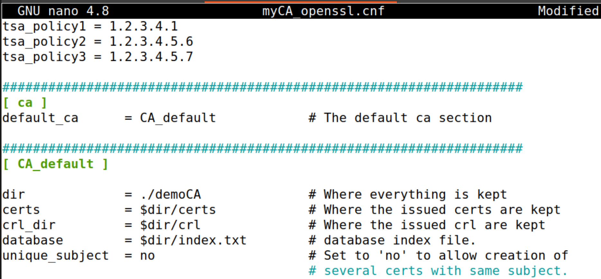

2.  **Geração do Certificado da CA:**
    Utilizámos o seguinte comando para gerar a chave privada (`ca.key`) e o certificado público (`ca.crt`):
    ```bash
    openssl req -x509 -newkey rsa:4096 -sha256 -days 3650 \
      -keyout ca.key -out ca.crt \
      -subj "/CN=www.modelCA.com/O=Model CA LTD./C=US" \
      -passout pass:dees
    ```

3.  **Análise do Certificado:**
    Verificámos o conteúdo do certificado gerado.
    - **Basic Constraints (CA:TRUE):** Confirma que este certificado tem permissão para assinar outros certificados.
      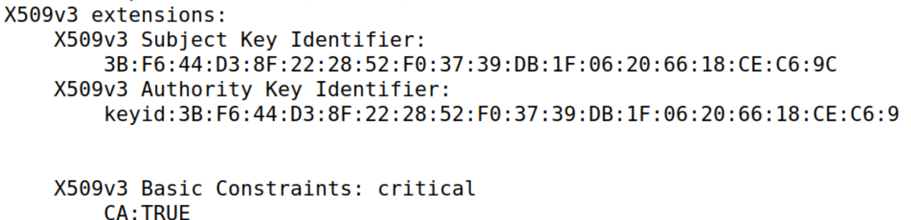
    - **Issuer = Subject:** Confirma que é um certificado auto-assinado (Root CA).
      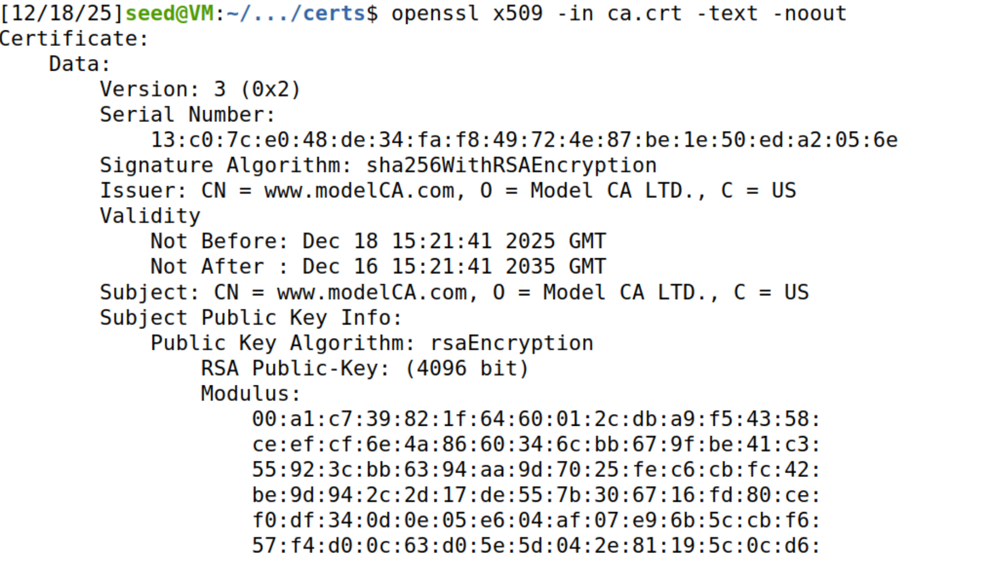
    - **Chave Privada:** Analisámos os componentes RSA (módulo, expoentes, primos).
      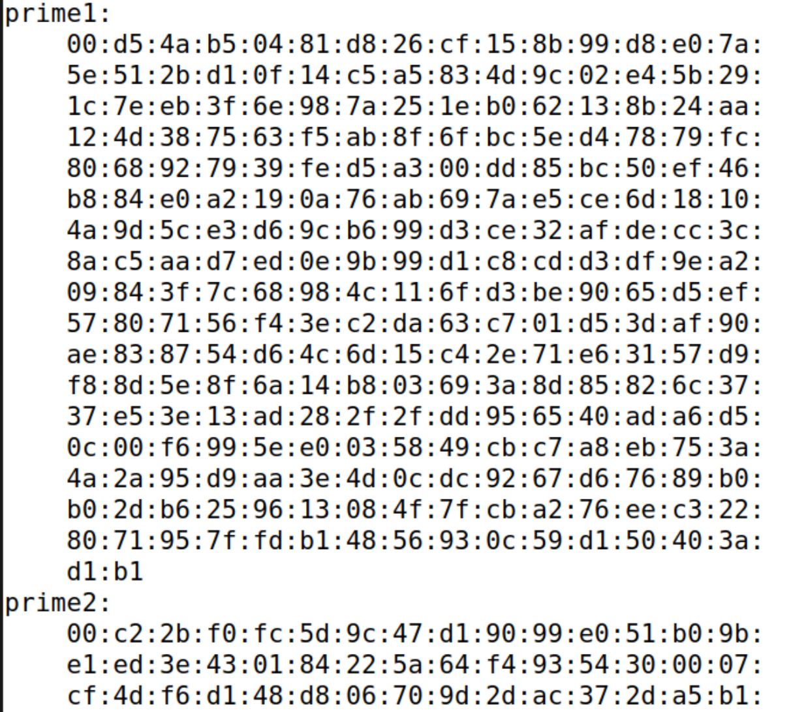
      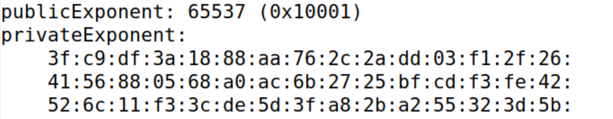

## 4. Tarefa 2: Gerar um Pedido de Certificado (CSR)
Para obter um certificado para o nosso servidor web, primeiro gerámos um Certificate Signing Request (CSR).

1.  **Geração do CSR:**
    Criámos a chave privada do servidor (`server.key`) e o CSR (`server.csr`) para o domínio `www.filipe2025.com`. Incluímos nomes alternativos (SAN) para compatibilidade.
    ```bash
    openssl req -newkey rsa:2048 -sha256 \
      -keyout server.key -out server.csr \
      -subj "/CN=www.filipe2025.com/O=Filipe Inc./C=PT" \
      -passout pass:dees \
      -addext "subjectAltName = DNS:www.filipe2025.com,DNS:www.filipe2025A.com,DNS:www.filipe2025B.com"
    ```

2.  **Verificação do CSR:**
    Confirmámos que o CSR contém o `Subject` correto e a chave pública.
    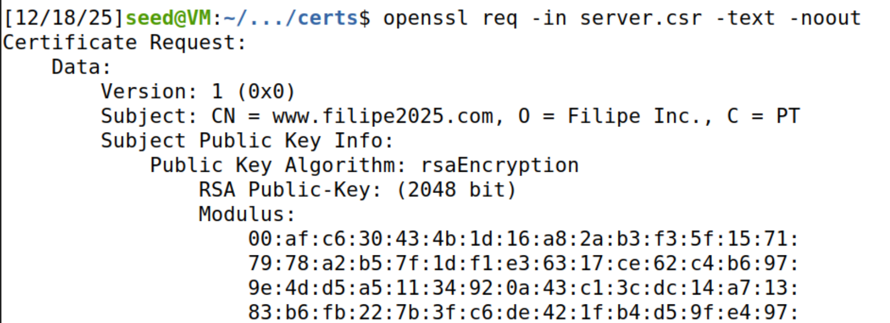
    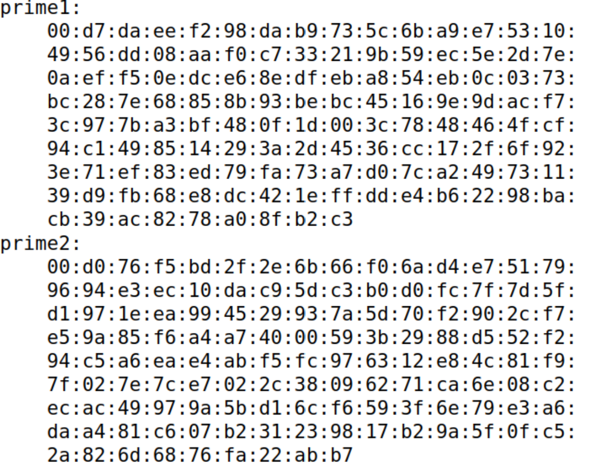
    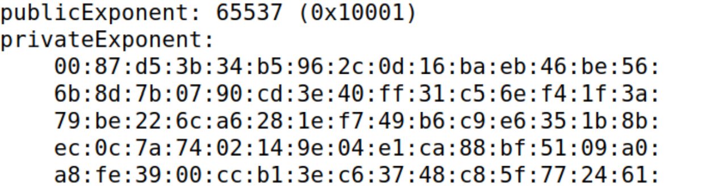

## 5. Tarefa 3: Gerar um Certificado para o Servidor
Como CA, assinámos o CSR do servidor para emitir o certificado final.

1.  **Configuração da CA:**
    Descomentámos a linha `copy_extensions = copy` no ficheiro de configuração para permitir a cópia dos campos SAN (Subject Alternative Name) do CSR para o certificado.
    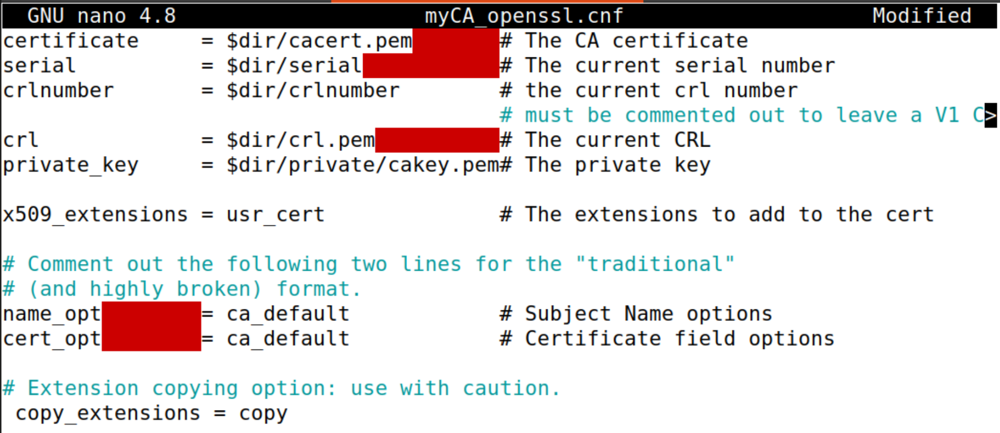

2.  **Assinatura do Certificado:**
    ```bash
    openssl ca -config myCA_openssl.cnf -policy policy_anything \
      -md sha256 -days 3650 \
      -in server.csr -out server.crt -batch \
      -cert ca.crt -keyfile ca.key
    ```
    O output confirma a atualização da base de dados da CA e a emissão do certificado.
    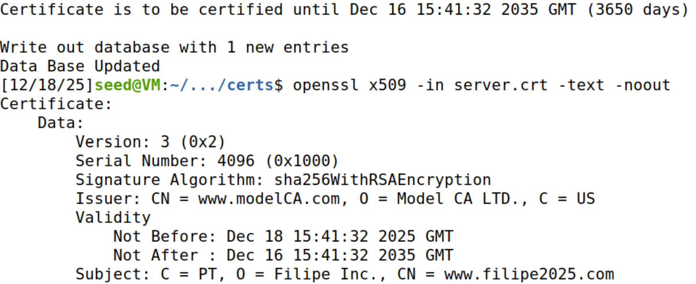

3.  **Verificação do Certificado Final:**
    Confirmámos que o `server.crt` inclui os nomes alternativos (SAN) solicitados.
    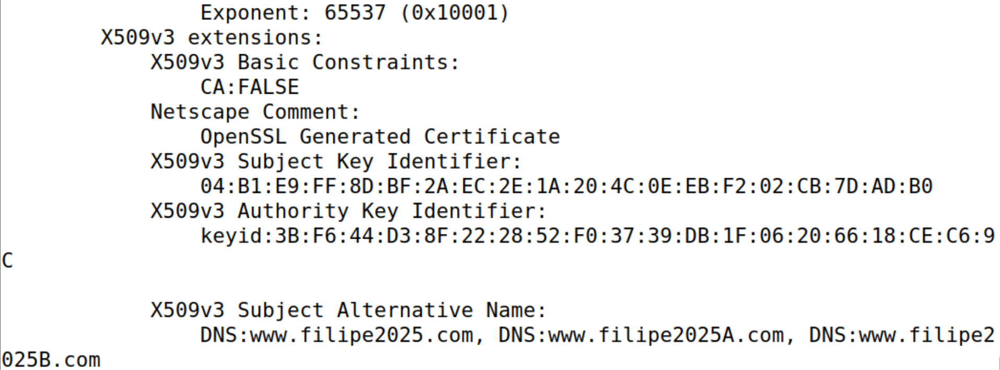

## 6. Tarefa 4: Deploy do Certificado num Servidor HTTPS Apache
Instalámos o certificado no servidor Apache para habilitar HTTPS.

1.  **Configuração do Apache:**
    Editámos o ficheiro `/etc/apache2/sites-available/filipe2025_apache_ssl.conf` dentro do container, apontando para `server.crt` e `server.key`.
    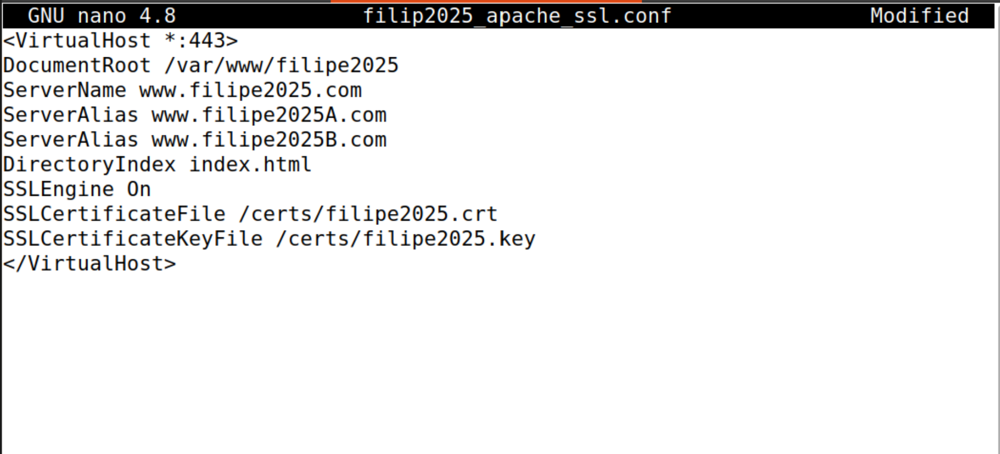

2.  **Reinício do Serviço:**
    Ativámos o site e reiniciámos o Apache, inserindo a password da chave privada (`dees`).
    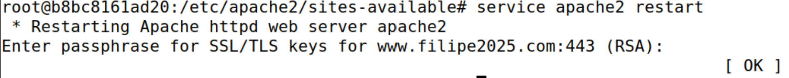

3.  **Teste no Browser (Antes de Confiar na CA):**
    Ao aceder a `https://www.filipe2025.com`, o Firefox apresentou um aviso de segurança ("Potential Security Risk Ahead"). Isto ocorreu porque o navegador não reconhecia a nossa CA auto-assinada como confiável.
    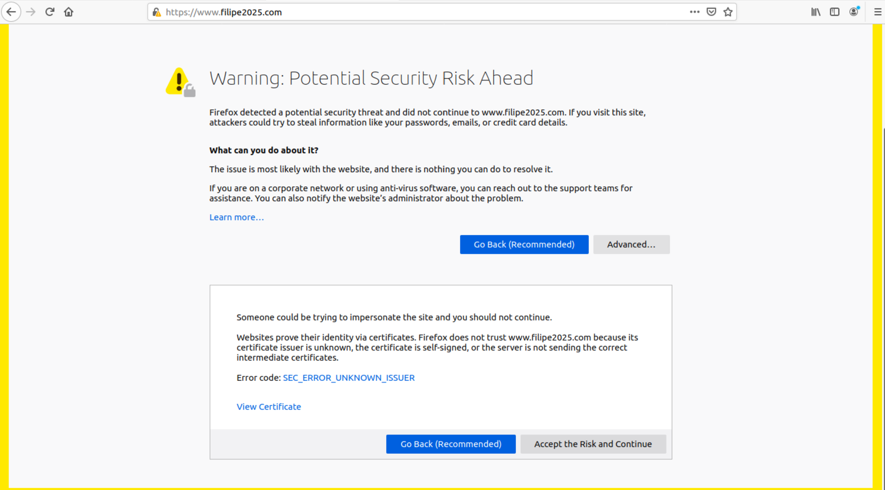

4.  **Estabelecer Confiança:**
    Importámos o certificado da CA (`ca.crt`) para a lista de Autoridades do Firefox.
    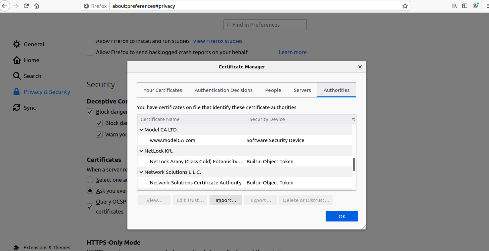

5.  **Sucesso:**
    Após confiar na CA, o site carregou corretamente com o cadeado verde, indicando uma conexão segura e verificada.
    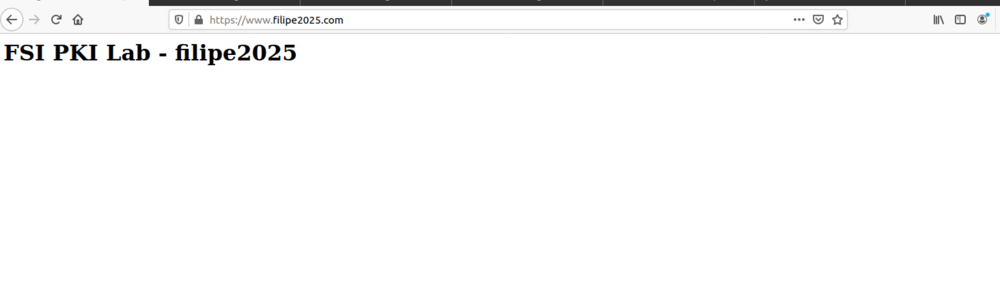

## 7. Tarefa 5: Lançar um Ataque Man-In-The-Middle (MITM)
Nesta tarefa, demonstrámos como a PKI protege os utilizadores contra ataques MITM, mesmo quando o atacante consegue desviar o tráfego.

**Cenário do Ataque:**
Simulámos um ataque de envenenamento de DNS (ou ARP spoofing) alterando o ficheiro `/etc/hosts` da vítima (VM). Fizemos com que o domínio `www.example.com` resolvesse para o IP do nosso container malicioso (`10.9.0.80`).

**Execução:**
O nosso servidor Apache estava configurado para responder a pedidos para `www.example.com`, mas apresentava o certificado gerado na Tarefa 3, que pertence a `www.filipe2025.com`.

**Observação e Explicação Técnica:**
Ao tentar aceder a `https://www.example.com`, o navegador exibiu um **aviso de segurança** bloqueando a conexão automática.

Isto acontece devido ao mecanismo de **validação de hostname** no protocolo TLS:
1.  **Handshake:** O cliente (browser) conecta-se ao IP do atacante (pensando ser `www.example.com`) e recebe o certificado do servidor.
2.  **Validação da Assinatura:** O browser verifica a assinatura do certificado. Como confiámos na CA na Tarefa 4, a assinatura é considerada válida.
3.  **Validação do Hostname (A Falha):** O browser compara o domínio que o utilizador digitou (`www.example.com`) com os nomes presentes nos campos *Common Name (CN)* ou *Subject Alternative Name (SAN)* do certificado.
4.  **Resultado:** O certificado apresentado contém `www.filipe2025.com`, que **não corresponde** a `www.example.com`.

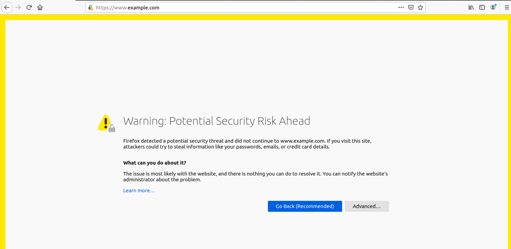

**Conclusão:**
A PKI impediu o ataque MITM com sucesso. Mesmo controlando o DNS e tendo um certificado válido (mas para outro domínio), o atacante não conseguiu impersonar o site alvo sem gerar um alerta no navegador.

## 8. Tarefa 6: Lançar um Ataque MITM com uma CA Comprometida
Nesta tarefa, explorámos a fragilidade central da PKI: a confiança absoluta na chave privada da CA. Diferente da Tarefa 5, onde o certificado era inválido para o domínio, aqui simulamos o cenário catastrófico onde a própria autoridade de confiança foi comprometida.

**Cenário:**
Assumimos que o atacante comprometeu a CA raiz e roubou a sua chave privada (`ca.key`). Com esta chave, o atacante tem o poder de emitir certificados para *qualquer* domínio que os navegadores aceitarão como legítimos.

**Execução:**
1.  **Falsificação do CSR:** O atacante gerou um novo CSR especificamente para o domínio alvo `www.example.com`.
2.  **Assinatura Fraudulenta:** Utilizando a chave roubada (`ca.key`), o atacante assinou este CSR. Como a chave é genuína, a assinatura criptográfica é matematicamente válida.
3.  **Deploy:** O servidor Apache malicioso foi reconfigurado para apresentar este novo certificado forjado.
    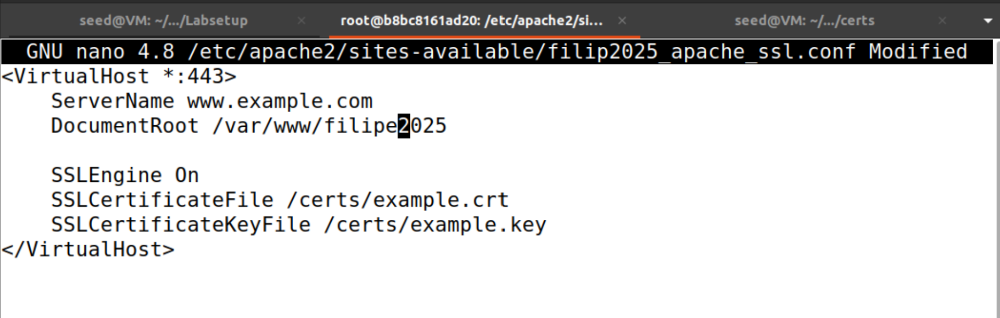

**Observação e Explicação Técnica:**
Ao aceder a `https://www.example.com` novamente, o comportamento foi drasticamente diferente da Tarefa 5. O navegador **não apresentou qualquer aviso** e exibiu o cadeado de segurança verde, tratando a conexão como perfeitamente segura.
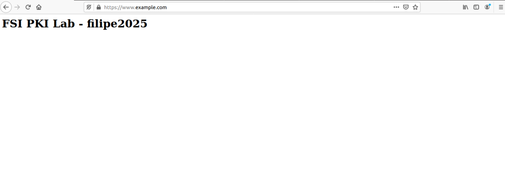

**Por que é que isto funcionou?**
O navegador realizou a validação padrão do TLS, e o ataque passou em todas as verificações:
1.  **Cadeia de Confiança (Chain of Trust):** O navegador verificou quem assinou o certificado. Como foi assinado pela nossa CA (que adicionámos aos "Trusted Authorities" na Tarefa 4), o navegador confia na assinatura.
2.  **Validação de Hostname:** O navegador verificou se o domínio no URL (`www.example.com`) correspondia ao certificado. Como o atacante criou um certificado especificamente para `www.example.com`, esta verificação passou.
3.  **Validade Temporal:** O certificado estava dentro do prazo de validade.

**Conclusão:**
Este exercício demonstra que a **chave privada da CA é o "Santo Graal" da segurança na Web**.
-   Na Tarefa 5, o ataque falhou porque o certificado não correspondia ao site (proteção de domínio).
-   Na Tarefa 6, o ataque teve sucesso porque a raiz de confiança foi subvertida.

Se a chave privada de uma CA for comprometida, um atacante pode realizar ataques MITM transparentes contra qualquer site (Google, Bancos, Redes Sociais). O utilizador não tem forma de distinguir o site real do site falso, pois o navegador valida a criptografia como legítima. É por isso que as CAs reais utilizam Hardware Security Modules (HSM) e segurança física extrema para proteger as suas chaves privadas.
