# LOGBOOK 13 – Laboratório de Packet Sniffing e Spoofing

## 1. Visão Geral
O objetivo deste laboratório é compreender as ameaças de packet sniffing e spoofing utilizando ferramentas como o Scapy e o Wireshark. Aprendemos a capturar tráfego de rede, filtrar pacotes específicos, falsificar pacotes IP com endereços de origem arbitrários, implementar uma ferramenta de traceroute e, finalmente, combinar sniffing e spoofing para intercetar e responder ao tráfego, simulando um cenário de Man-In-The-Middle.

## 2. Configuração do Ambiente
Utilizámos a configuração de containers Docker fornecida, consistindo numa máquina atacante e dois hosts vítimas (Host A e Host B) na mesma LAN.

-   **Máquina Atacante:** `seed-attacker` (10.9.0.1)
-   **Host A:** 10.9.0.5
-   **Host B:** 10.9.0.6
-   **Interface de Rede:** Identificámos a interface bridge `br-8ea8b9516c52` usando `ifconfig` e `docker network ls`. Esta é a interface onde realizaremos o sniffing.

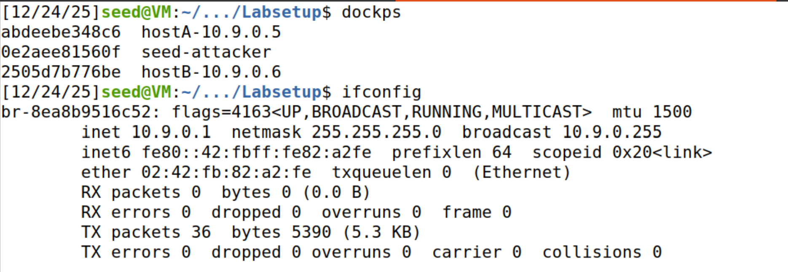
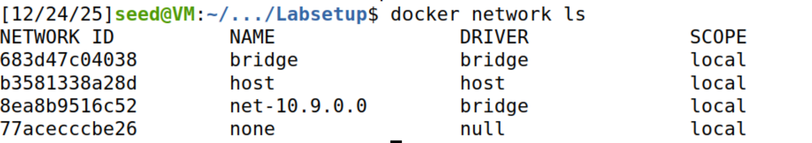


## 3. Tarefa 1.1: Sniffing de Pacotes

### Tarefa 1.1A: Sniffer Básico
Escrevemos um script Python `sniffer.py` usando Scapy para capturar pacotes na interface bridge.

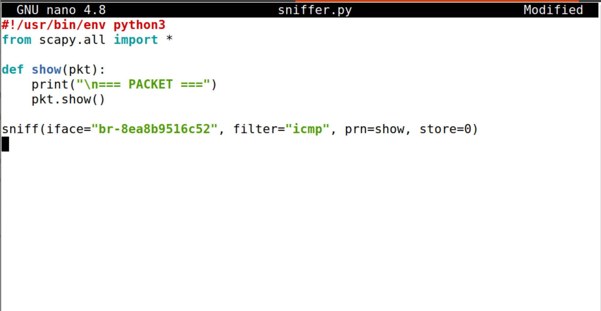

**Análise do Código:**
O script utiliza a função `sniff()` do Scapy, que é a interface principal para captura de pacotes.
-   `iface="br-8ea8b9516c52"`: Especifica a interface de rede onde o sniffing ocorrerá.
-   `filter="icmp"`: Aplica um filtro BPF para capturar apenas pacotes do protocolo ICMP.
-   `prn=show`: Define uma função de callback (`show`) que é executada para cada pacote capturado. A nossa função `show` imprime os detalhes do pacote usando `pkt.show()`.
-   `store=0`: Instrui o Scapy a não armazenar os pacotes em memória, o que é essencial para sniffers de longa duração para evitar exaustão de RAM.

**Observações:**
1.  **Executando como Root:** Quando executámos o script com `sudo`, capturámos com sucesso pacotes ICMP gerados por um comando `ping` entre o Host A e o Host B.
    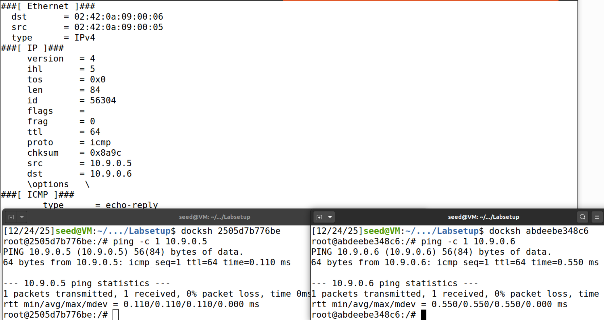

2.  **Executando como Seed (Sem Root):** Quando tentámos executar o script sem privilégios de root, falhou com um `PermissionError`.
    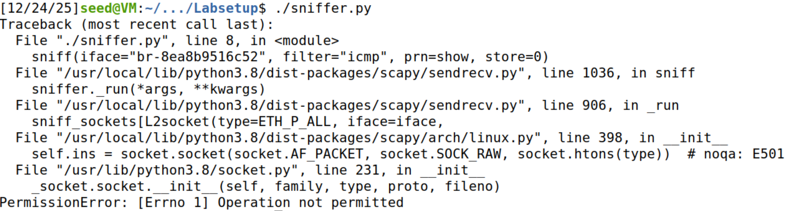
    
    **Explicação:** 
    O packet sniffing depende de **Raw Sockets** (especificamente `AF_PACKET` com `SOCK_RAW` em Linux). Os sockets padrão (como `SOCK_STREAM` para TCP) apenas fornecem à aplicação o payload de dados (Camada 7) após o kernel do SO ter processado e removido os cabeçalhos (Ethernet, IP, TCP). 
    
    Um raw socket, no entanto, instrui o kernel a fornecer uma cópia de todo o pacote, incluindo cabeçalhos, diretamente à aplicação. Além disso, para capturar tráfego não destinado ao próprio host, a interface de rede deve ser colocada em **Modo Promíscuo**. Este modo diz à Placa de Interface de Rede (NIC) para passar todo o tráfego que recebe para o CPU, em vez de descartar pacotes endereçados a outros endereços MAC.
    
    Como estas capacidades permitem que um utilizador intercete dados sensíveis (passwords, emails, etc.) de outros utilizadores na rede, o sistema operativo restringe o acesso ao utilizador `root` (ou utilizadores com a capacidade `CAP_NET_RAW`). É por isso que o script falhou quando executado como o utilizador padrão `seed`.

### Tarefa 1.1B: Filtragem de Pacotes
Modificámos o BPF (Berkeley Packet Filter) no `sniffer.py` para capturar tipos específicos de tráfego. O BPF é uma tecnologia usada no kernel para filtrar pacotes *antes* de serem copiados para a aplicação em user-space, o que é crucial para o desempenho.

1.  **Apenas ICMP:**
    -   Filtro: `filter="icmp"`
    -   Observação: Capturámos pacotes `echo-request` e `echo-reply`.

2.  **Porta TCP 23 (Telnet):**
    -   Filtro: `filter="tcp and src host 10.9.0.5 and dst port 23"`
    -   Teste: Executámos `nc -l -p 23` no Host B e conectámos a partir do Host A usando `nc 10.9.0.6 23`.
    -   Observação: O sniffer capturou o handshake TCP (SYN, ACK) e os pacotes de dados contendo a mensagem "hello23".
    -   **Explicação:** O filtro combina primitivas de protocolo (`tcp`), IP de origem (`src host`) e porta de destino (`dst port`). Isto garante que apenas vemos tráfego iniciado pelo Host A direcionado ao serviço Telnet no Host B.
    
    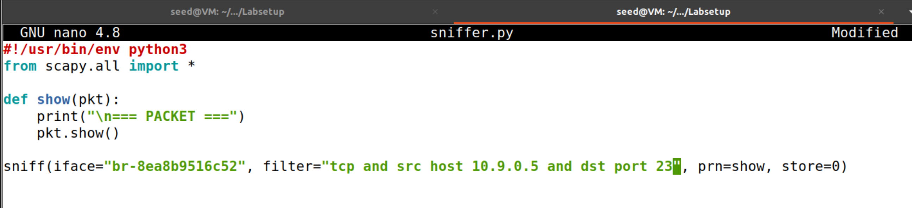
    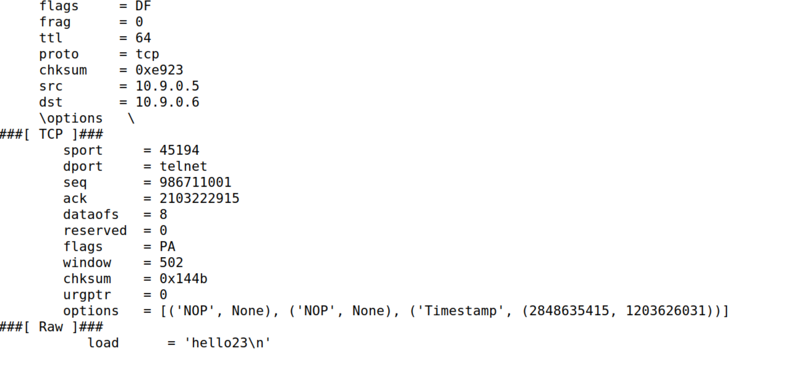

3.  **Tráfego de Sub-rede:**
    -   Filtro: `filter="net 128.230.0.0/16"`
    -   Teste: Fizemos ping a `128.230.0.1` a partir do Host A.
    -   Observação: O sniffer capturou os pacotes ICMP de saída destinados à sub-rede especificada.
    -   **Explicação:** A primitiva `net` permite filtrar por bloco CIDR. Isto é útil para monitorizar tráfego de/para organizações ou segmentos de rede específicos.
    
    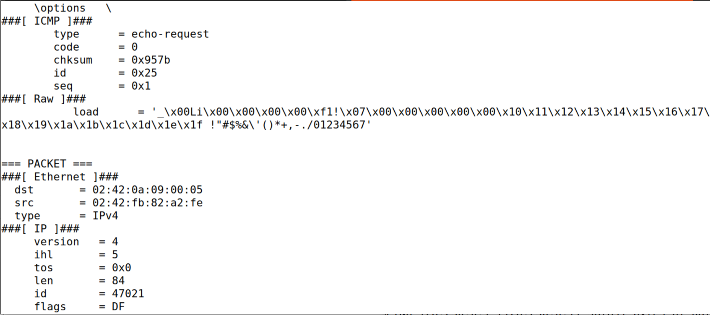

## 4. Tarefa 1.2: Spoofing de Pacotes ICMP
O objetivo foi falsificar um pacote ICMP Echo Request com um endereço IP de origem arbitrário. Criámos o `spoof_icmp.py`.

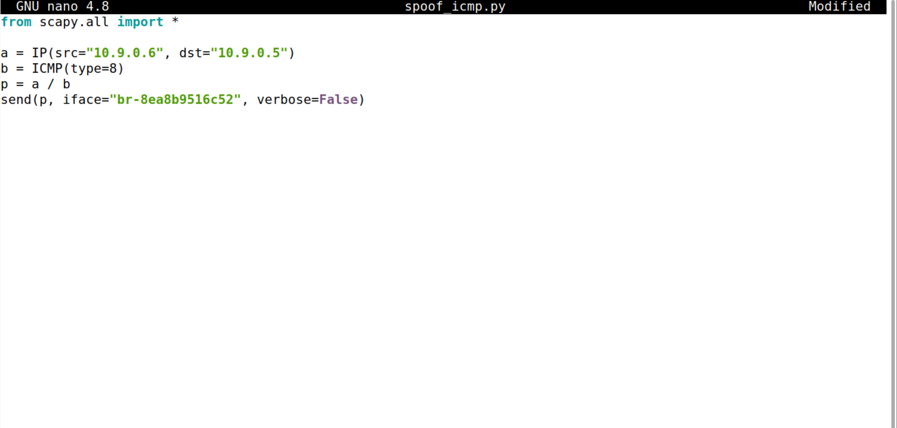

**Análise do Código:**
-   `a = IP()`: Cria um novo objeto de cabeçalho IP.
-   `a.src = '10.9.0.6'`: Define o endereço IP de origem falsificado para ser o do Host B.
-   `a.dst = '10.9.0.5'`: Define o destino para o Host A.
-   `b = ICMP()`: Cria um cabeçalho ICMP padrão (o tipo padrão é Echo Request).
-   `p = a/b`: O operador `/` no Scapy encapsula a camada ICMP dentro da camada IP.
-   `send(p)`: Envia o pacote construído para a rede.

**Observação:**
Usámos o Wireshark para monitorizar o tráfego.
1.  Observámos um pacote **Echo Request** que parecia originar de `10.9.0.6` (Host B) destinado a `10.9.0.5` (Host A).
2.  O Host A aceitou o pacote e enviou um **Echo Reply** de volta para `10.9.0.6`.

**Explicação:**
Esta tarefa demonstra uma falta fundamental de autenticação no protocolo IP. Um cabeçalho de pacote IP contém um campo `Source IP`, mas os routers e hosts padrão não verificam se o pacote realmente originou desse IP. Eles simplesmente confiam no cabeçalho.

Quando usamos o Scapy:
1.  **Construção do Pacote:** Construímos manualmente o cabeçalho IP, definindo `src` como `10.9.0.6`. O Scapy calcula automaticamente o **Checksum** correto para os cabeçalhos IP e ICMP. Se o checksum estivesse incorreto, o SO recetor descartaria o pacote como corrompido.
2.  **Injeção:** O Scapy usa um raw socket para injetar este pacote fabricado diretamente no fio da rede.
3.  **Comportamento da Vítima:** O Host A recebe o pacote. Vê `src=10.9.0.6` no cabeçalho. Seguindo o padrão do protocolo, quando gera a resposta (Echo Reply), troca a origem e o destino. Assim, a resposta é enviada para o endereço *falsificado* (`10.9.0.6`), não para a máquina do atacante. Esta é a base para ataques de **Reflected Denial of Service (DoS)**, onde um atacante falsifica o IP de uma vítima para inundá-la com respostas de servidores terceiros.

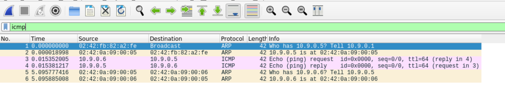

## 5. Tarefa 1.3: Traceroute
Implementámos uma ferramenta de traceroute `traceroute_scapy.py` para estimar a distância (em saltos) até um destino. A ferramenta funciona enviando pacotes com valores de TTL (Time-To-Live) incrementais.

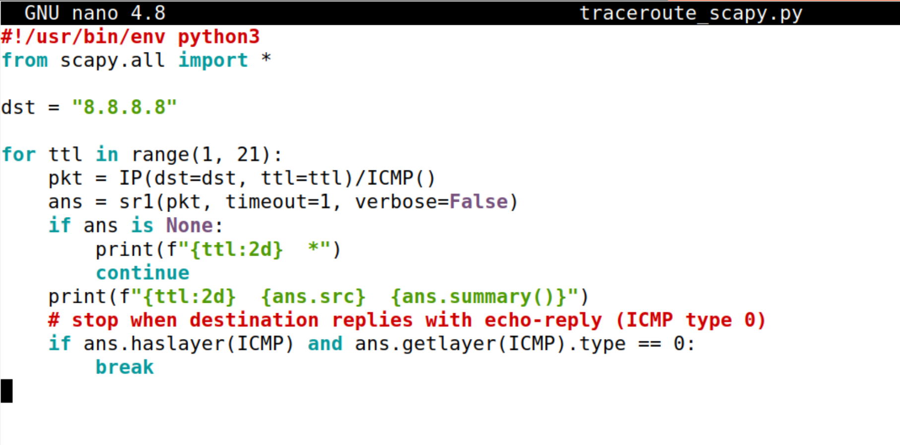

**Análise do Código:**
O script itera através de valores de TTL de 1 a 30.
-   `a = IP()`: Cria o cabeçalho IP.
-   `a.dst = '8.8.8.8'`: Define o destino (Google DNS).
-   `a.ttl = i`: Define o TTL para o valor atual do loop.
-   `b = ICMP()`: Cria o cabeçalho ICMP.
-   `send(a/b)`: Envia o pacote.
O script depende da receção de mensagens de erro ICMP "Time Exceeded" dos routers intermédios.

**Resultado:**
```
 1  8.8.8.8  IP / ICMP 8.8.8.8 > 10.0.2.15 echo-reply 0 / Padding
```
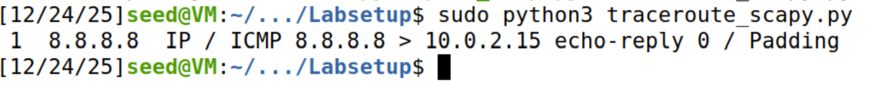

**Explicação:**
O campo **Time-To-Live (TTL)** no cabeçalho IP foi desenhado para impedir que pacotes circulem indefinidamente em loops de roteamento.
1.  **Mecanismo:** Cada router que processa um pacote decrementa o TTL em 1.
2.  **Expiração:** Se o TTL chegar a 0, o router descarta o pacote e envia uma mensagem **ICMP Time Exceeded (Type 11)** de volta à origem.
3.  **Lógica do Traceroute:**
    -   **TTL=1:** O pacote chega ao primeiro router (Gateway). O router descarta-o e envia "Time Exceeded". Registamos o IP do router.
    -   **TTL=2:** O pacote passa o primeiro router (TTL torna-se 1) e chega ao segundo router. O segundo router descarta-o e envia "Time Exceeded".
    -   **TTL=N:** Isto continua até o pacote chegar ao destino. O destino não o descarta; em vez disso, processa o ICMP Echo Request e envia um **ICMP Echo Reply (Type 0)**. Isto sinaliza o fim do rastreio.

## 6. Tarefa 1.4: Sniffing e depois Spoofing
Combinámos sniffing e spoofing para criar um programa que responde automaticamente a ICMP Echo Requests, independentemente de o IP alvo existir. Isto simula uma máquina que afirma ser qualquer endereço IP na rede.

**Código (`sniff_spoof.py`):**
O script faz sniffing de ICMP Echo Requests (`type=8`). Quando um é detetado, constrói um Echo Reply falso (`type=0`) trocando os endereços IP de origem e destino do pacote capturado, e envia-o de volta.

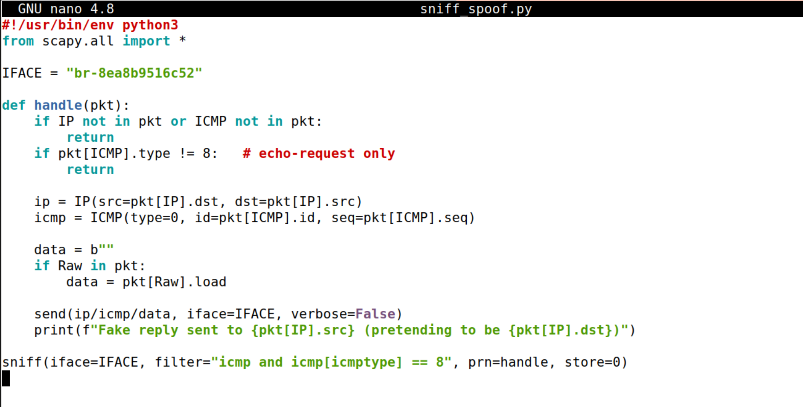

**Análise do Código:**
-   `sniff(..., prn=spoof_pkt)`: Captura pacotes e passa cada um para a função `spoof_pkt`.
-   `if pkt[ICMP].type == 8`: Verifica se o pacote é um Echo Request.
-   `ip = IP(src=pkt[IP].dst, dst=pkt[IP].src)`: Constrói o cabeçalho IP de resposta. **Crucial:** O `src` da resposta é o `dst` do pedido original (o IP que estamos a falsificar), e o `dst` da resposta é o `src` do pedido original (a vítima).
-   `icmp = ICMP(type=0, id=pkt[ICMP].id, seq=pkt[ICMP].seq)`: Constrói o cabeçalho ICMP Echo Reply. Devemos copiar o `id` e `seq` do pedido original para que a vítima aceite a resposta como válida.
-   `data = pkt[Raw].load`: Copia qualquer payload de dados (opcional).
-   `send(newpkt)`: Envia o pacote falsificado.

**Experiências (realizadas a partir do Host A):**

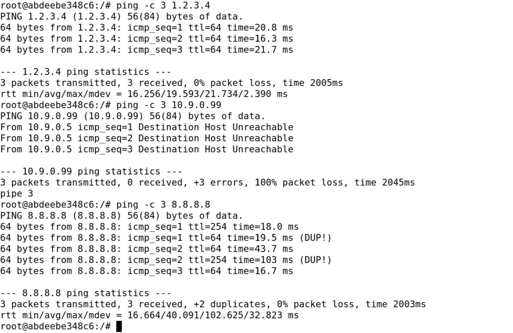
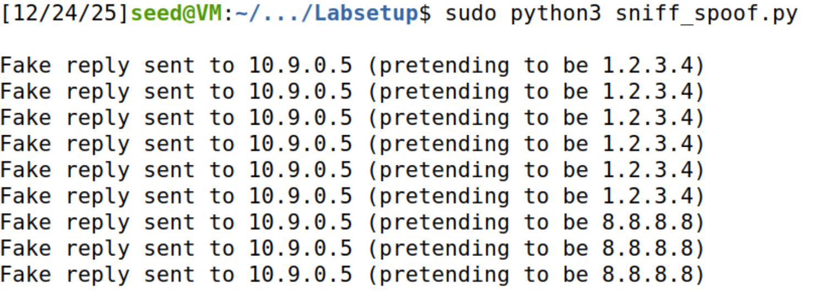

1.  **Ping 1.2.3.4 (IP de Internet Inexistente):**
    -   **Resultado:** `64 bytes from 1.2.3.4: icmp_seq=1 ...` (Ping bem-sucedido).
    -   **Explicação:**
        -   **Roteamento:** O Host A verifica a sua tabela de roteamento. `1.2.3.4` não está na sub-rede local (`10.9.0.0/24`). Portanto, o pacote deve ser enviado para o **Default Gateway** (`10.9.0.1`).
        -   **Encapsulamento L2:** O Host A envia uma frame Ethernet com `Dst MAC = Gateway MAC` e `Dst IP = 1.2.3.4`.
        -   **Sniffing:** A nossa máquina atacante está na mesma bridge/rede. O sniffer vê este pacote.
        -   **Spoofing:** O script gera imediatamente uma resposta com `Src IP = 1.2.3.4` e envia-a para o Host A. O Host A aceita-a, acreditando que `1.2.3.4` está vivo.

2.  **Ping 10.9.0.99 (IP de LAN Inexistente):**
    -   **Resultado:** `Destination Host Unreachable`.
    -   **Explicação:**
        -   **Falha ARP:** O Host A vê que `10.9.0.99` está na *mesma* sub-rede local. Para enviar o pacote, precisa do **endereço MAC** de `10.9.0.99`.
        -   **Broadcast ARP:** O Host A transmite um **ARP Request**: "Who has 10.9.0.99? Tell 10.9.0.5".
        -   **Sem Resposta:** Como o host não existe, ninguém responde com um ARP Reply.
        -   **Descarte de Pacote:** Sem o endereço MAC de destino, o Host A **não consegue construir a frame Ethernet**. O pacote IP nunca é transmitido.
        -   **Sniffer "cego":** Como o pacote ICMP nunca é enviado (apenas pedidos ARP são enviados), o nosso sniffer (filtrando por ICMP) nunca vê nada para desencadear a lógica de spoofing.

3.  **Ping 8.8.8.8 (IP de Internet Existente):**
    -   **Resultado:** `64 bytes from 8.8.8.8 ... (DUP!)`.
    -   **Explicação:**
        -   **Race Condition:** O Host A envia o pedido para o Gateway (destinado a `8.8.8.8`).
        -   **Caminho 1 (Real):** O Gateway roteia o pacote para a Internet. O servidor da Google recebe-o e envia um Echo Reply real.
        -   **Caminho 2 (Falso):** Simultaneamente, o nosso sniffer captura o pedido e injeta um Echo Reply falso.
        -   **Resultado:** O Host A recebe **duas respostas**. A primeira (geralmente a local falsificada, pois é mais rápida que a viagem de ida e volta à Internet) é aceite como a resposta. A segunda chega mais tarde e é marcada pelo SO como um **Duplicado (DUP!)** porque corresponde ao mesmo Número de Sequência e ID do pacote já processado.
