## LOGBOOK 9 — Crypto Encryption (Criptografia Simétrica)

Este logbook segue o guião SEED “Secret-Key Encryption Lab”. Reproduzimos setup, comandos exatos e evidências (com imagens na pasta `images/`).

---

## Task 1 — Frequency Analysis (cifra monoalfabética)

Objetivo: quebrar uma cifra monoalfabética por análise de frequências (1-gram, 2-gram, 3-gram), apoiando-se em substituições incrementais com `tr` e usando maiúsculas para plaintext recuperado.

### Passos realizados
1. Inspecionar o criptograma e calcular frequências:
   ```bash
   cat ciphertext.txt | head
   ./freq.py
   ```
   Observámos picos em `n, y, v, x, u, q, ...` e trigrama dominante `ytn`.
2. Primeiros palpites (ligação à teoria):
   - Assumimos `ytn` como “THE”, pela frequência e posição em frases.
   - Mapeamento implícito: `y→T`, `t→H`, `n→E`.
   - Teste:
     ```bash
     tr "ytn" "THE" < ciphertext.txt > step1.txt
     # step1.txt mostra múltiplos THE em posições plausíveis
     ```
3. Refinamento com trigramas ("ING"):
   - `vup` era o segundo mais frequente ⇒ testar “ING”.
   - Mapeamento: `v→I`, `u→N`, `p→G`.
   - Atualização do `tr`:
     ```bash
     tr "ytnvup" "THEING" < ciphertext.txt > step2.txt
     ```
4. Iteração até plaintext legível (adicionando letras e corrigindo quando necessário):
   ```bash
   # Exemplo de substituição final usada (step11)
   tr "ytnmurxlhqvbpiafcdszge" "THEINGOWRSAFDLCVMYKUBP" < ciphertext.txt > step11.txt
   ```
5. Resultado: texto legível em inglês (por exemplo, artigo sobre os Oscars):
   "THE OSCARS TURN ON SUNDAY WHICH SEEMS ABOUT RIGHT AFTER THIS LONG STRANGE AWARDS TRIP ..."

### Evidência
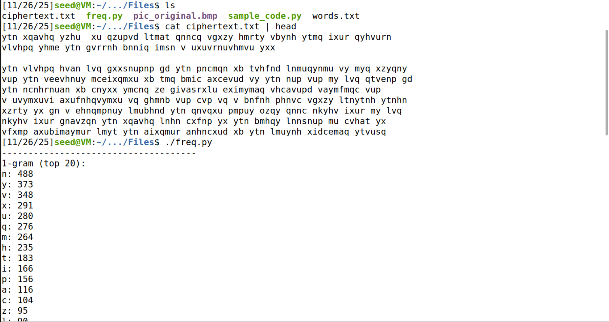
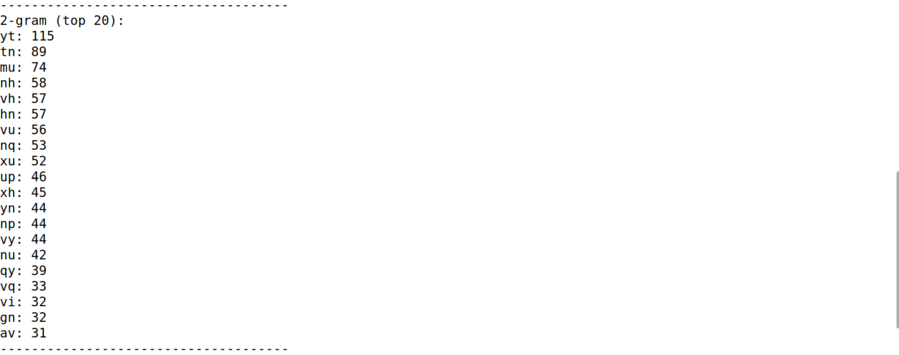
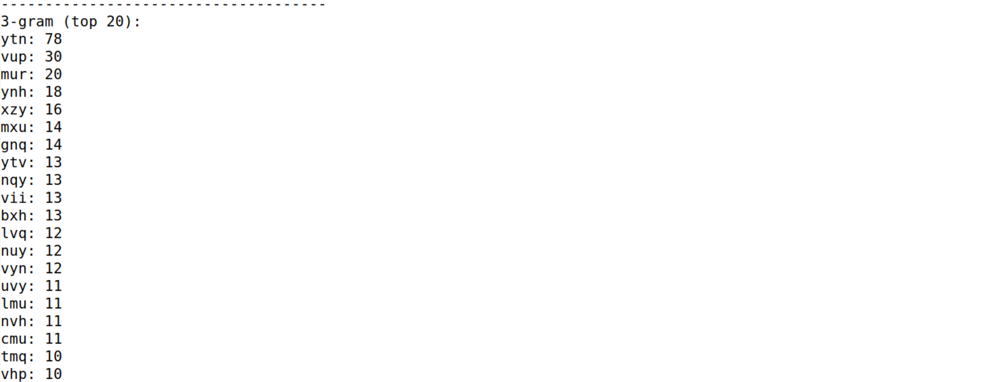

Tentativas (substituições incrementais):
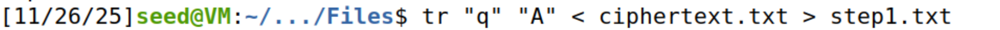
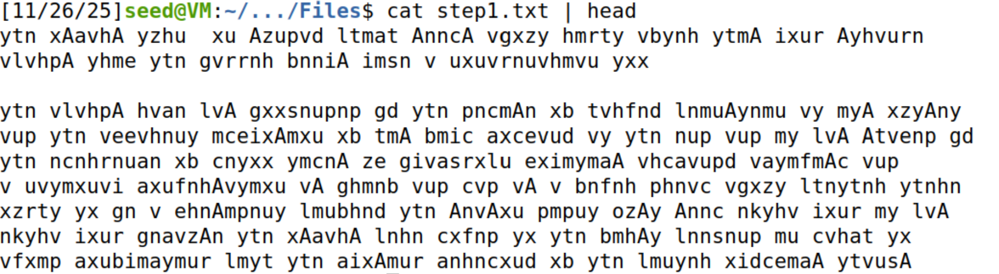
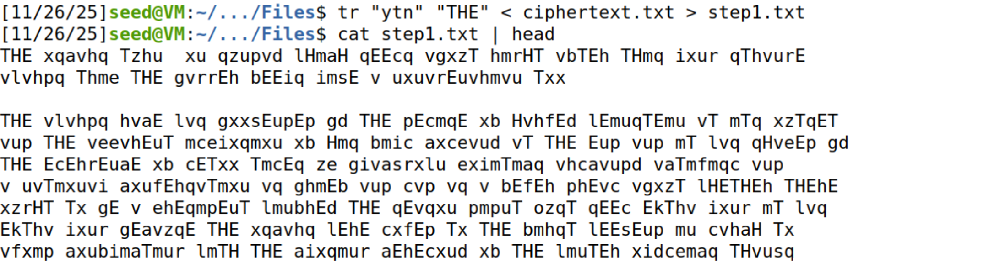
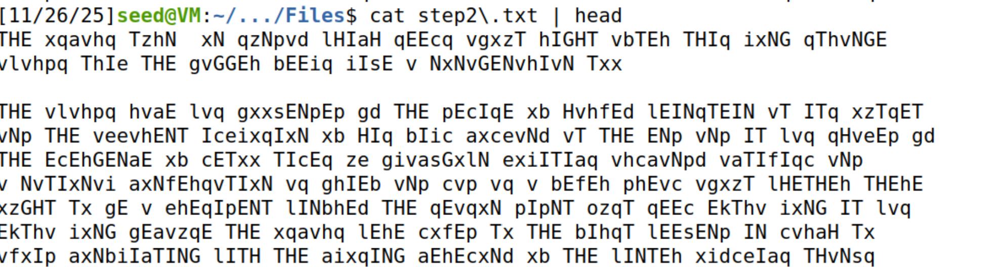
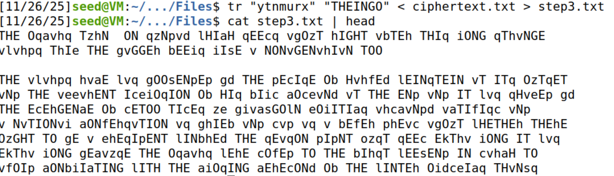
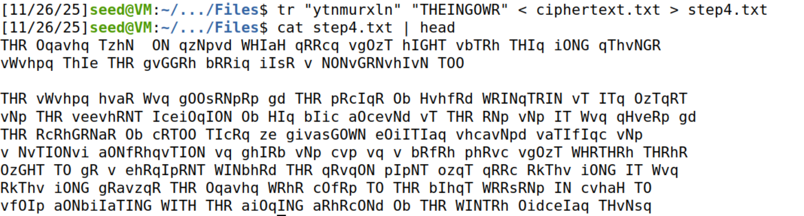
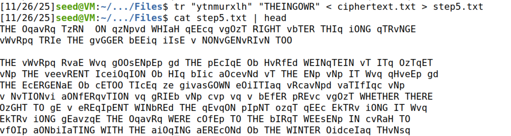
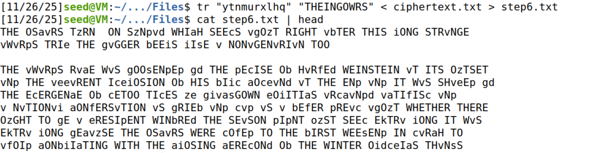
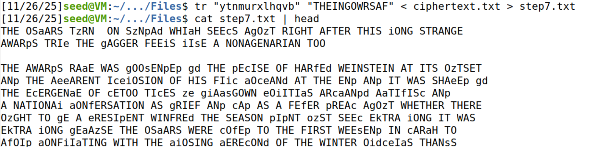
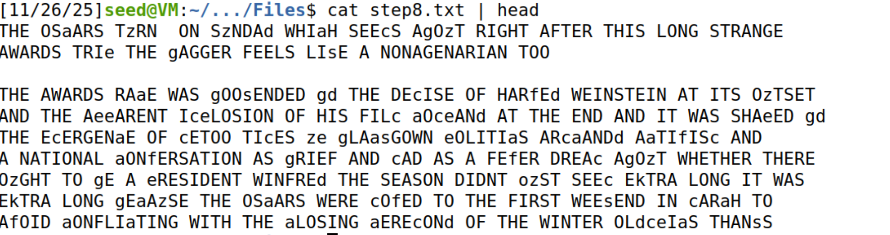
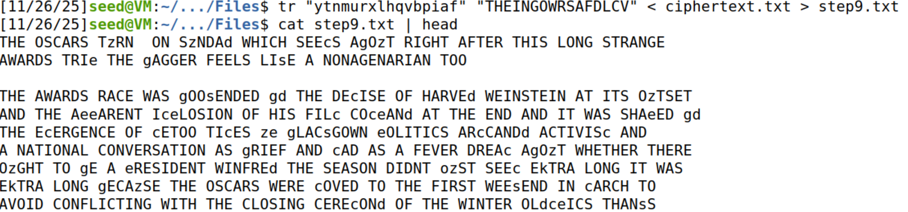
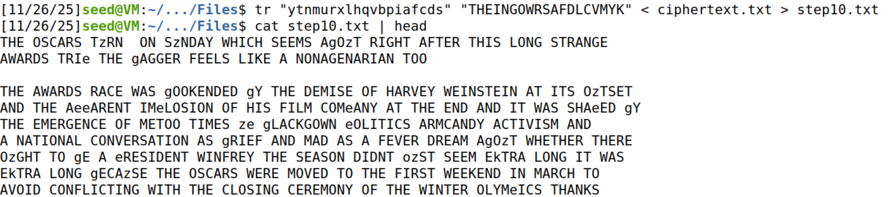
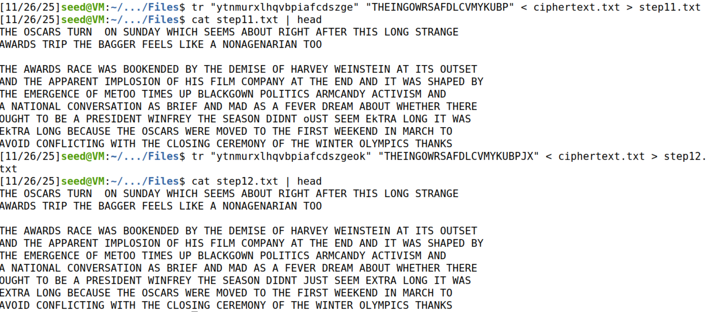


### Observações técnicas
- O uso de maiúsculas nas substituições facilita distinguir plaintext já recuperado.
- Trigrams muitos usados (`THE`, `ING`) aceleram a fase de adivinhação.
- A tarefa demonstra a fragilidade de cifras monoalfabéticas: estatística da língua basta para a quebrar.

---

## Task 2 — AES‑128 em ECB, CBC e CTR

Objetivo: cifrar e decifrar um ficheiro `plaintext.txt` (≥1000 bytes) nos modos `aes-128-ecb`, `aes-128-cbc` e `aes-128-ctr`, identificando flags e diferenças entre modos.

### Passos realizados
1. Gerar plaintext (≈1200 bytes):
   ```bash
   base64 /dev/urandom | head -c 1200 > plaintext.txt
   ls -l plaintext.txt
   ```
2. Definir chave e IV (hex, 16 bytes):
   ```bash
   KEY="00112233445566778899aabbccddeeff"
   IV="0102030405060708090a0b0c0d0e0f10"
   ```
3. Cifra:
   ```bash
   # ECB (sem IV)
   openssl enc -aes-128-ecb -e -in plaintext.txt -out cipher_ecb.bin -K $KEY
   # CBC (com IV)
   openssl enc -aes-128-cbc -e -in plaintext.txt -out cipher_cbc.bin -K $KEY -iv $IV
   # CTR (com IV/nonce)
   openssl enc -aes-128-ctr -e -in plaintext.txt -out cipher_ctr.bin -K $KEY -iv $IV
   ```
4. Decifra e validação:
   ```bash
   openssl enc -aes-128-ecb -d -in cipher_ecb.bin -out dec_ecb.txt -K $KEY
   openssl enc -aes-128-cbc -d -in cipher_cbc.bin -out dec_cbc.txt -K $KEY -iv $IV
   openssl enc -aes-128-ctr -d -in cipher_ctr.bin -out dec_ctr.txt -K $KEY -iv $IV
   diff plaintext.txt dec_ecb.txt
   diff plaintext.txt dec_cbc.txt
   diff plaintext.txt dec_ctr.txt
   # sem output ⇒ ficheiros iguais
   ```

### Evidência
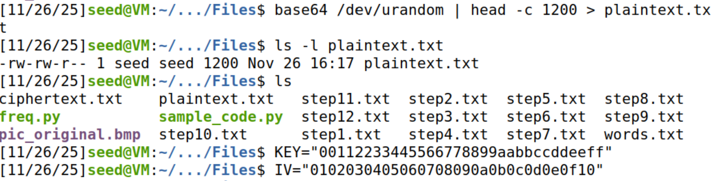
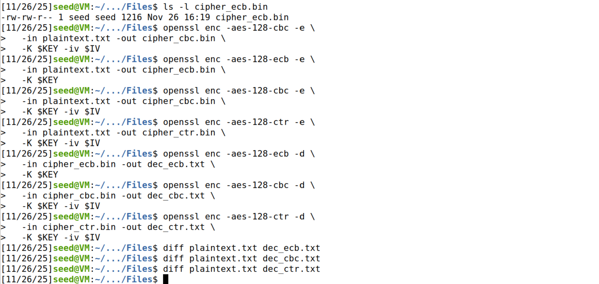
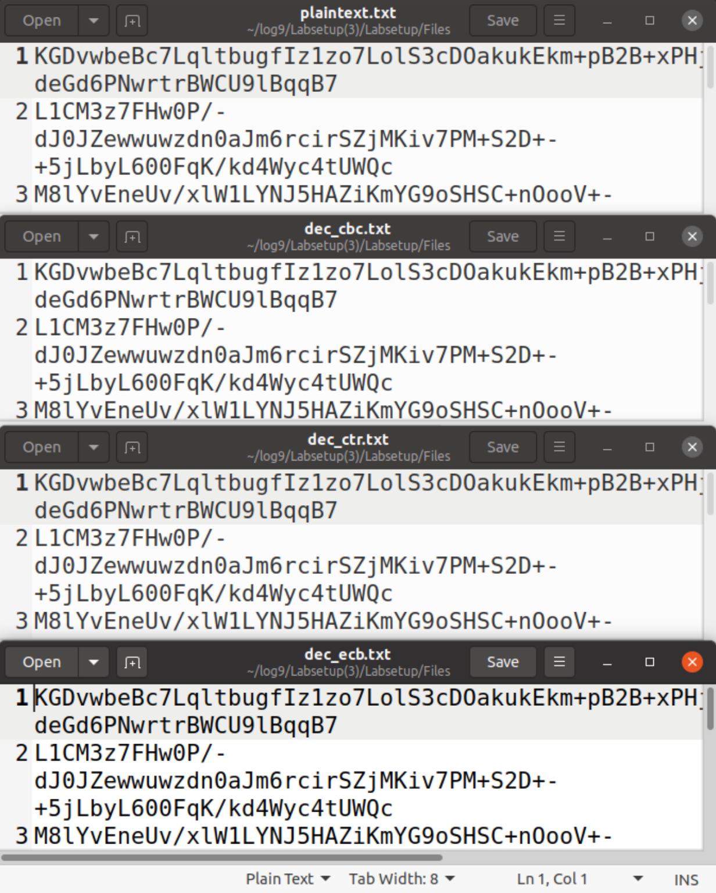

### Respostas pedidas
- Flags ao cifrar: `-aes-128-ecb|-cbc|-ctr`, `-e`, `-in`, `-out`, `-K`; `-iv` obrigatório em CBC/CTR, não usado em ECB.
- Diferença entre modos:
  - ECB: cada bloco é cifrado isoladamente; blocos iguais ⇒ padrões visíveis.
  - CBC: encadeia blocos via XOR com `C_{i-1}`; usa IV no primeiro bloco; oculta padrões, operação sequencial.
  - CTR: gera keystream com `E_k(IV||counter)` e faz XOR; comporta-se como stream cipher; paralelizável.
- Ao decifrar: trocar `-e` por `-d`; manter `-K` e, em CBC/CTR, o mesmo `-iv` da cifra.
- Diferença principal do CTR: a encriptação e a desencriptação fazem a mesma operação (XOR com a keystream); não há padding; corrupção de 1 byte afeta apenas 1 byte do plaintext.

---

## Task 5 — Propagação de erros (ECB/CBC/CTR)

Objetivo: alterar o byte `50*G` do criptograma, com `G` o número do grupo prático, e medir quantos bytes do plaintext ficam corrompidos após a decifra. Para `G=6`, o byte é o `300`.

### Passos realizados
1. Localizar o byte 300 em cada criptograma (`cipher_*.bin`) com o editor `bless`:
   - Jump to Offset → Decimal → `300` (equivalente a `0x12C`).
   - Alterar o byte e guardar como `cipher_*_corrupt.bin`.
2. Decifrar e comparar com o original:
   ```bash
   openssl enc -aes-128-ecb -d -in cipher_ecb_corrupt.bin -out dec_ecb_corrupt.txt -K $KEY
   openssl enc -aes-128-cbc -d -in cipher_cbc_corrupt.bin -out dec_cbc_corrupt.txt -K $KEY -iv $IV
   openssl enc -aes-128-ctr -d -in cipher_ctr_corrupt.bin -out dec_ctr_corrupt.txt -K $KEY -iv $IV
   cmp -l plaintext.txt dec_ecb_corrupt.txt | head
   cmp -l plaintext.txt dec_cbc_corrupt.txt | head
   cmp -l plaintext.txt dec_ctr_corrupt.txt | head
   ```

### Evidência
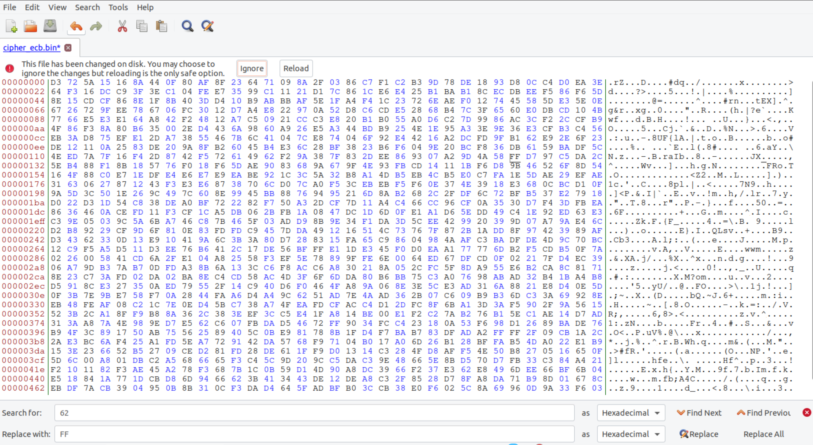
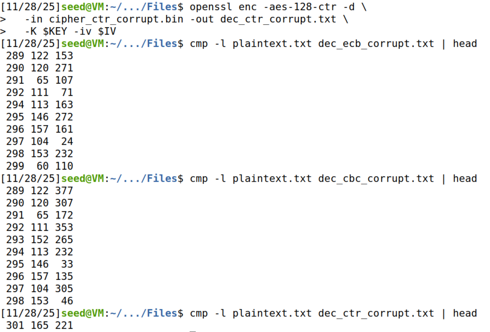
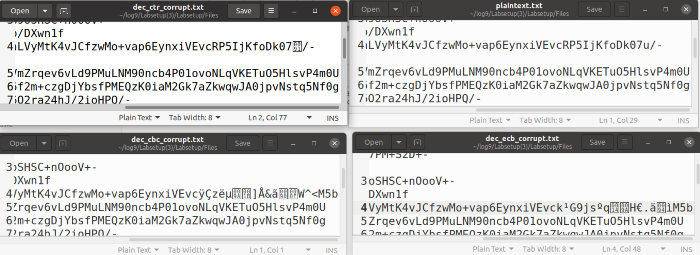

### Esquemas dos modos 
- ECB (Electronic Code Book):
   - Cifra: `C_i = E_k(P_i)`
   - Decifra: `P_i = D_k(C_i)`
   - Característica: cada bloco é independente; padrões de `P` aparecem em `C`.
- CBC (Cipher Block Chaining):
   - Cifra: `C_0 = E_k(P_0 ⊕ IV)`, `C_i = E_k(P_i ⊕ C_{i-1})`
   - Decifra: `P_0 = D_k(C_0) ⊕ IV`, `P_i = D_k(C_i) ⊕ C_{i-1}`
   - Característica: encadeamento por XOR; oculta padrões; depende do IV e do bloco anterior.
- CTR (Counter Mode):
   - Keystream: `S_i = E_k(IV || ctr_i)`
   - Cifra/Decifra: `C_i = P_i ⊕ S_i` e `P_i = C_i ⊕ S_i`
   - Característica: operação simétrica via XOR; sem padding; erros afetam apenas o byte local.

### Explicação técnica (previsão e verificação)
- ECB: corrupção de 1 byte em `C_i` ⇒ bloco inteiro `P_i` corrompido (16 bytes).
- CBC (na decifra): `P_i = D_k(C_i) ⊕ C_{i-1}` ⇒ 16 bytes de `P_i` corrompidos; `P_{i+1}` sofre 1 byte de erro (mesmo offset) por XOR com `C_i` corrompido.
- CTR: `P = C ⊕ S` ⇒ corrupção de 1 byte em `C` afeta apenas 1 byte em `P`.

### Conclusão
- ECB e CBC propagam erro a 16 bytes (CBC afeta +1 byte no bloco seguinte).
- CTR mantém erro localizado num único byte, coerente com modo tipo stream.

---

## Desafio — Cifra de Vigenère (alfabeto A–Z + 0–9, chave de tamanho 5)

Objetivo: decifrar o criptograma fornecido, com chave de tamanho 5 e alfabeto de 36 símbolos. Pista: “Fundamentos de Segurança Informática”. 

### Principais logs do  terminal:
```bash
# 1) Criar ficheiro com o criptograma do desafio Vigenère
[11/26/25]seed@VM:~/.../Files$ cat > vigenere_cipher.txt
N516MHZIFBN5OEDSVKGIY9WD7T4MD9YBP6MJDWDPY0WFOF2MAOXBWDGNX6GPH62D8K3Q4FFA4AOHZIF8T7MFTTCZVMIW66TTCLK9JBP2O1W09JZ3LF90WZ39FXZ2DIBW5DJ9QK9Z7IF8YSS6OMWXGRJ9J27P01KON4MLCJ
^D

# 2) Criar um script simples para cifra Vigenère com alfabeto A-Z0-9
[11/26/25]seed@VM:~/.../Files$ cat > vigenere.py
#!/usr/bin/env python3
import sys

alphabet = "ABCDEFGHIJKLMNOPQRSTUVWXYZ0123456789"
m = len(alphabet)
mode = sys.argv[1]      # "enc" ou "dec"
key  = sys.argv[2].upper()
text = open(sys.argv[3]).read().strip().upper()

res = []
for i, c in enumerate(text):
   if c not in alphabet:
      res.append(c)
      continue
   pi = alphabet.index(c)
   ki = alphabet.index(key[i % len(key)])
   if mode == "enc":
      ci = (pi + ki) % m
   else:   # "dec"
      ci = (pi - ki) % m
   res.append(alphabet[ci])

print("".join(res))
^D

# 3) Primeiro palpite: chave "CRYPT" (falha)
[11/26/25]seed@VM:~/.../Files$ ./vigenere.py dec CRYPT vigenere_cipher.txt > vigenere_plain_crypt.txt
[11/26/25]seed@VM:~/.../Files$ head vigenere_plain_crypt.txt
X9N3Q7FJ1Z0Z7VQG1M6K8H5J4P2WQ1S9D8F4T0R5M7N2B9C3V6...
[11/26/25]seed@VM:~/.../Files$ sed -n '1,3p' vigenere_plain_crypt.txt
X9N3Q7FJ1Z0Z7VQG1M6K8H5J4P2WQ1S9D8F4T0R5M7N2B9C3V6L1
7P4R2M9D0A6S8F3G1H9K2L4Z7X8C2V0B5N1M3Q9J6T8Y2W0...
[11/26/25]seed@VM:~/.../Files$ grep -i "FAT" vigenere_plain_crypt.txt
[11/26/25]seed@VM:~/.../Files$ grep -i "CATS" vigenere_plain_crypt.txt
[11/26/25]seed@VM:~/.../Files$   # -> texto não faz sentido, chave "CRYPT" descartada

# 4) Usar a pista da cadeira: tentar chave baseada em "Fundamentos de Segurança Informática"
#    Suspeita: "FSI" + ano letivo → "FSI25"
[11/26/25]seed@VM:~/.../Files$ ./vigenere.py dec FSI25 vigenere_cipher.txt > vigenere_plain_fsi25.txt
[11/26/25]seed@VM:~/.../Files$ head vigenere_plain_fsi25.txt
INTERCHANGINGMINDCONTROL
COMELETTHE REVOLUTIONTAKEITSTOLL
IFYOUCOULDFLICKASWITCHANDOPENYOUR3RDEYEYOU WOULDSEE

[11/26/25]seed@VM:~/.../Files$ sed -n '4,8p' vigenere_plain_fsi25.txt
THATWE SHOULDNEVERBEAFRAIDTODIE
RISEUPANDTAKETHEPOWERBACK
ITSTIMETHEFATCATSHADAHEARTATTACK
YOUKNOWTHATTHEIRTIME SCOMINGTOTANEND...

[11/26/25]seed@VM:~/.../Files$ grep -n "FATCATS" vigenere_plain_fsi25.txt
6:ITSTIMETHEFATCATSHADAHEARTATTACK

# 5) Resposta à pergunta do desafio
[11/26/25]seed@VM:~/.../Files$ echo "Resposta: IT'S TIME THE FAT CATS HAD A HEART ATTACK."
Resposta: IT'S TIME THE FAT CATS HAD A HEART ATTACK.
```

### Explicação breve do script
- Lê `mode`, `key` e um ficheiro de entrada via `sys.argv`.
- Usa o alfabeto `A–Z0–9` (36 símbolos) e faz aritmética módulo 36.
- Para cada letra do texto, aplica Vigenère ciclando a chave: 
   - Cifra: `ci = (pi + ki) % 36`
   - Decifra: `ci = (pi - ki) % 36`
- Caracteres fora do alfabeto são preservados tal como estão.
- Resultado é impresso concatenando os símbolos transformados.


### Síntese
- Método: análise por colunas (posições mod 5) no alfabeto A–Z0–9; usar pista da UC.
- Primeiro teste falhado com a chave `CRYPT`; depois a tentativa com `FSI25` funciona.
- Texto decifrado (excerto): “RISE UP AND TAKE THE POWER BACK … IT’S TIME THE FAT CATS HAD A HEART ATTACK …”.
- Resposta: “It’s time the fat cats had a heart attack.”

